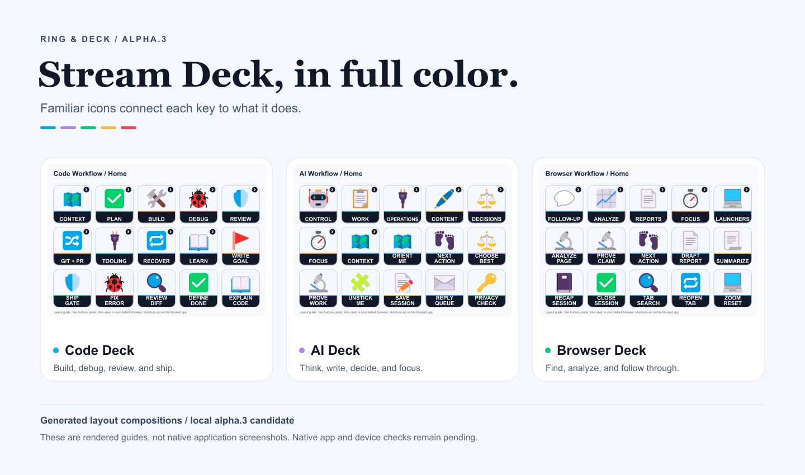
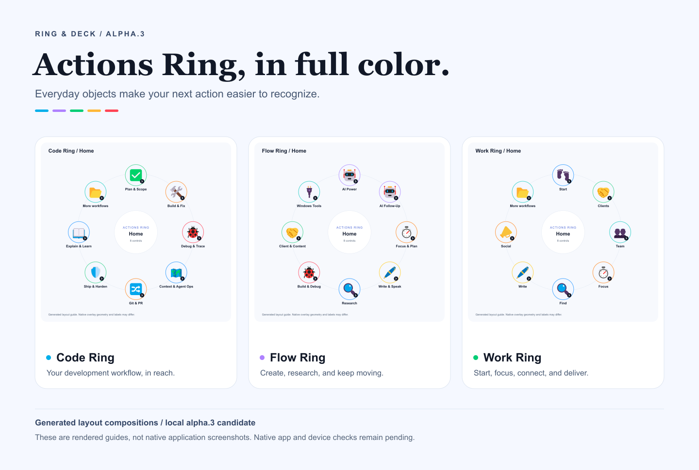
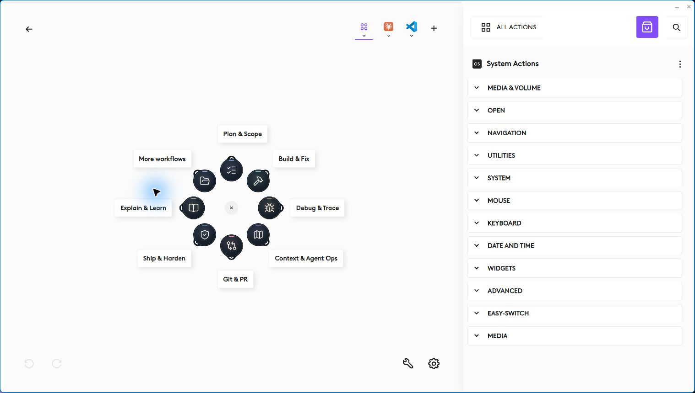
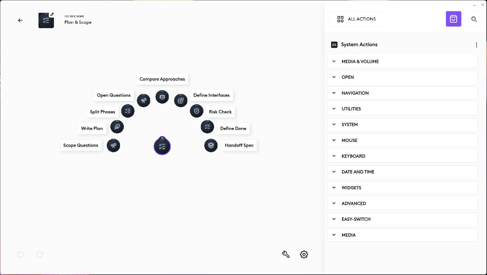

# Ring & Deck

**Reusable prompts and everyday controls for Logitech Actions Ring and Elgato Stream Deck.**

Stop hunting for the same prompt or switching menus for a routine action. Ring & Deck puts coding, writing, research and Windows controls into six editable profiles. Choose a workflow, open its folders and send a useful starting prompt to the app you already use.

Three profiles for **Logitech Actions Ring**, and three for **Elgato Stream Deck**. A shared graphite theme, soft category accents and action-specific symbols make the controls easier to recognize. [Explore every layout](docs/gallery.html).

**Alpha prerelease candidate: `v0.1.0-alpha.2`.** This updates the Sharp build dependency to 0.35.4 with no profile functionality changes. All 13 automated tests pass. Native Code Ring evidence comes from alpha.1, which has the same actions and artwork; broader native and hardware acceptance remains incomplete. [Validation status](docs/VALIDATION.md).

## Download an alpha candidate

Get packages and release details from the [GitHub alpha prerelease](https://github.com/alkhunizan/RingAndDeck/releases/tag/v0.1.0-alpha.2). Alpha.2 upload and remote verification are pending.

| Device | Download (alpha candidate) |
| --- | --- |
| Actions Ring | [Code Ring](https://github.com/alkhunizan/RingAndDeck/releases/download/v0.1.0-alpha.2/code-ring-0.1.0-alpha.2.lp5) |
| Actions Ring | [Work Ring](https://github.com/alkhunizan/RingAndDeck/releases/download/v0.1.0-alpha.2/work-ring-0.1.0-alpha.2.lp5) |
| Actions Ring | [Flow Ring](https://github.com/alkhunizan/RingAndDeck/releases/download/v0.1.0-alpha.2/flow-ring-0.1.0-alpha.2.lp5) |
| 15-key Stream Deck | [Code Workflow](https://github.com/alkhunizan/RingAndDeck/releases/download/v0.1.0-alpha.2/code-workflow-0.1.0-alpha.2.streamDeckProfile) |
| 15-key Stream Deck | [AI Workflow](https://github.com/alkhunizan/RingAndDeck/releases/download/v0.1.0-alpha.2/ai-workflow-0.1.0-alpha.2.streamDeckProfile) |
| 15-key Stream Deck | [Browser Workflow](https://github.com/alkhunizan/RingAndDeck/releases/download/v0.1.0-alpha.2/browser-workflow-0.1.0-alpha.2.streamDeckProfile) |

Verify downloads against [SHA256SUMS.txt](https://github.com/alkhunizan/RingAndDeck/releases/download/v0.1.0-alpha.2/SHA256SUMS.txt). Back up your current profiles and import candidates separately. Start with a blank scratch document and the [setup checklist](docs/SETUP.md).

## Choose a workflow

| Device | Profile | Contents | Use it for |
| --- | --- | --- | --- |
| Actions Ring | [Code Ring](docs/code-ring.md) | 81 prompts, 9 workflow folders | Scope, build, debug, Git, tooling and release review |
| Actions Ring | [Work Ring](docs/work-ring.md) | 81 prompts, 9 workflow folders | Clients, team, focus, writing, operations and recovery |
| Actions Ring | [Flow Ring](docs/flow-ring.md) | 65 prompts + 7 Windows controls, 8 folders | Everyday AI, research, content, dictation and window tools |
| Stream Deck | [Code Workflow](docs/code-workflow.md) | 83 unique prompts, 10 pages | Coding assistants in VS Code or another editor |
| Stream Deck | [AI Workflow](docs/ai-workflow.md) | 51 unique prompts, 8 pages | General AI work, decisions, focus and context |
| Stream Deck | [Browser Workflow](docs/browser-workflow.md) | 46 unique prompts + 14 public links + 3 shortcuts, 6 pages | Browser analysis, reporting, service launchers and focus |

Home shortcuts reuse prompts. Counts are unique within each profile; related ideas appear across devices. These are existing workflows adapted for public use, not six copies of one deck. [Selection and design rationale](docs/PREPARATION-PLAN.md).

Actions Ring Home supports 8 controls; folders support up to 9. Code Ring and Work Ring put their remaining workflow folders under **More workflows**, preserving all 81 prompts in each profile.

## Layout showcases





These screenshots are browser captures of designed showcases built from the generated layout guides. They are not native Stream Deck or Logi Options+ screenshots, and they do not demonstrate a successful import. Native fonts, placement and ring geometry may differ. [Explore the source layouts](docs/gallery.html).

## Native Code Ring checks



*Actual Logi Options+ capture of the alpha.1 Code Ring import. Home displays 8 populated controls. More workflows was also opened and showed Env & Tooling and Correct & Recover. Alpha.2 retains the same actions and artwork; it has not been separately imported. This checks configuration UI, not physical-button operation or prompt insertion.*



*Actual Plan & Scope folder capture from the build preceding the final alpha.1 import, with the same 9 actions retained in alpha.2. It verifies that folder's rendering; deeper nested navigation, text pasting and hardware behavior remain unverified. Work Ring, Flow Ring and Stream Deck imports still need UI acceptance.*

## How it works

**Text button:** focus your AI composer, activate a prompt, review it, replace bracketed placeholders and send manually. Text actions never press Enter. Ring text actions wait one second for the overlay to settle, then paste using the clipboard. Some prompts require context you must supply or tools your assistant must support.

**Website button:** Browser Workflow opens a public service entry point in your default browser. It does not select an account, browser profile, workspace or tenant. Check the destination account before working.

**Shortcut button:** the shortcut acts immediately on the focused app. Flow Ring includes Windows dictation, capture, clipboard history, file explorer, Task View, Snap Layout and plain paste. Browser Workflow includes tab search, reopen tab and reset zoom. Plain paste and browser shortcuts depend on the target application's support.

**Folder button:** opens a related group. Stream Deck includes Back keys; Actions Ring uses Logi Options+'s own folder navigation.

The profiles do not read browser pages themselves. For browser analysis, provide the page text or screenshot, or use an assistant with explicitly authorized browser access.

## Build and import

Target: **Windows**, **15-key Stream Deck (5 by 3)** and the **Logitech Actions Ring `Loupedeck72` profile format**. Other device layouts and macOS have not been validated.

Build requirements: Python 3.11+, Node.js 22+ and npm. Sharp 0.35.4 renders PNG icons for Logitech and is pinned in the lockfile. No API account is needed to build.

```sh
npm ci
python -m unittest discover -s tests -v
python scripts/build.py
python scripts/build.py --check
```

Outputs in `dist/`:

- `code-ring-0.1.0-alpha.2.lp5`
- `work-ring-0.1.0-alpha.2.lp5`
- `flow-ring-0.1.0-alpha.2.lp5`
- `code-workflow-0.1.0-alpha.2.streamDeckProfile`
- `ai-workflow-0.1.0-alpha.2.streamDeckProfile`
- `browser-workflow-0.1.0-alpha.2.streamDeckProfile`
- `SHA256SUMS.txt`

Back up your current profiles, then import these as separate profiles through the respective app's profile import control. **First test text actions in a blank scratch document.** Do not test them in a terminal, address bar or valuable document. Follow the [complete setup and acceptance checklist](docs/SETUP.md).

## API keys and privacy

**No AI model, API client or stored API keys.** These profiles paste instructions into the AI app you choose; you review and submit them manually. That app manages authentication, credentials, tool permissions, billing and retention. Sending a prompt may incur your provider's usual charges.

Profile data is readable, not encrypted secret storage:

- Editable catalogs: `profiles/*.json` and `rings/*.json` in this repository.
- Exported `.lp5` and `.streamDeckProfile` packages: ZIP archives containing settings, text and images.
- Installed Stream Deck data: usually `%APPDATA%/Elgato/StreamDeck/ProfilesV3`.
- Installed Actions Ring data in the inspected Windows setup: `%LOCALAPPDATA%/Logi/LogiPluginService/Applications/Loupedeck72`. Storage may change with Logi Options+ versions.

Never put API keys, client records or private account details in a shared action. Pasting can replace clipboard contents. Windows dictation and connected AI apps have their own data handling settings. A prompt's approval instruction is not an access-control mechanism. [Full security notes](SECURITY.md).

## What was generalized

Personal names, client businesses, account addresses, machine paths and installed profile identifiers were removed. Private client bookmarks were omitted. Local AI skill commands and custom AI hotkeys became self-contained prompts. Language, tone, time zone, brand and project details are user inputs.

Standard Windows controls and public browser entry points remain. All profiles have new deterministic identifiers and no personal executable binding. The source profiles are preserved unchanged.

## Customize and contribute

Edit the JSON catalogs and rebuild. The builder produces packages, full button guides, layout previews and hashes from the same data. Artwork is shared across both devices. Read [CONTRIBUTING.md](CONTRIBUTING.md) before extending actions.

The build rejects stale generated files after a version, page or profile is removed. Review and archive only the listed files outside the repository before rebuilding. It never deletes your files.

GitHub CI passed on Windows and Ubuntu for alpha.1. Alpha.2 CI and download verification are pending; the earlier runs are recorded in [validation](docs/VALIDATION.md). The workflow checks builds and uploads candidate artifacts; it does not publish a release. [Release checklist](RELEASE-CHECKLIST.md) | [Known limits](KNOWN-ISSUES.md) | [Format research](docs/research/profile-format.md).

## License

Prompt adaptations, builder and original visual composition: [MIT](LICENSE). Lucide SVG drawings: [ISC](assets/icons/LICENSE.txt), with [source notice](assets/icons/NOTICE.md). Product names belong to their respective owners; this is an independent community project.
