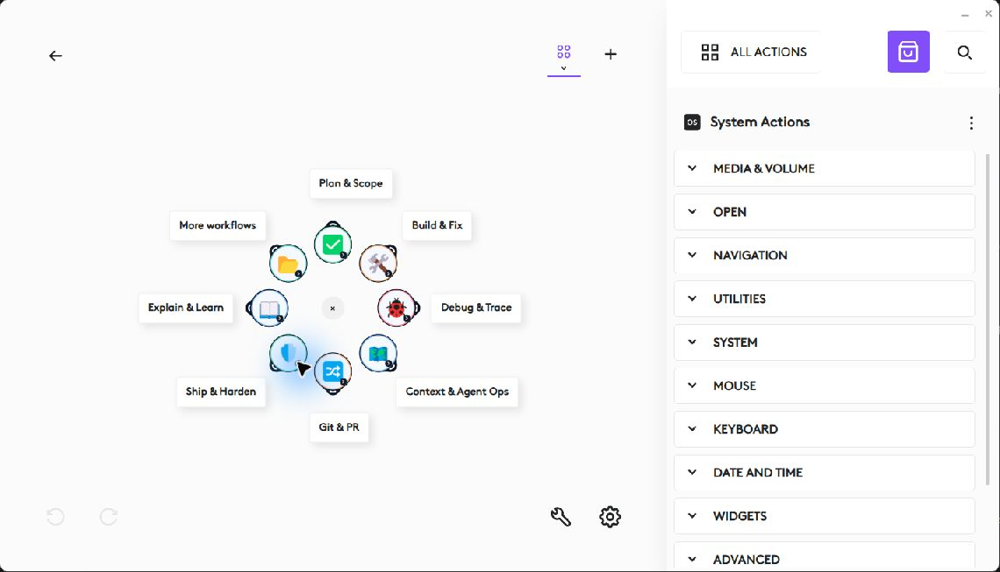
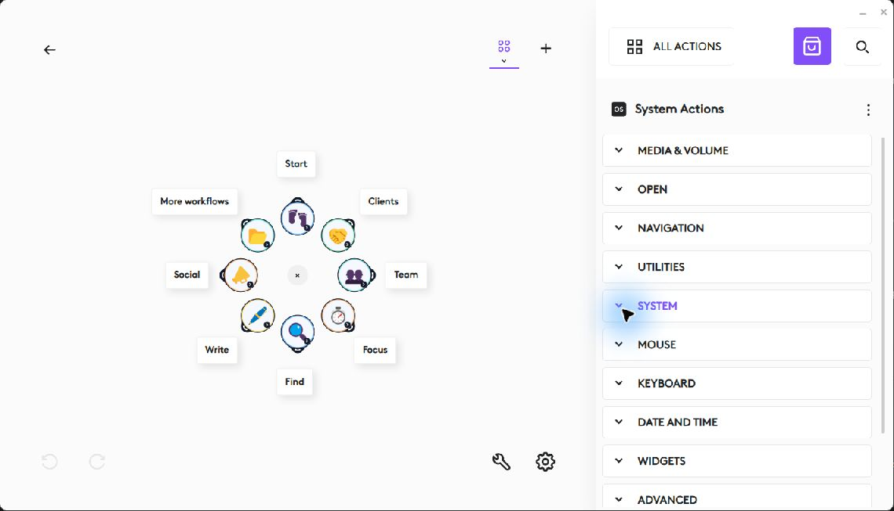
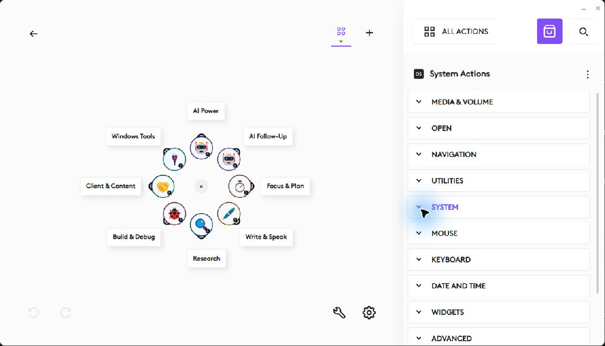

# Alpha.3 native Actions Ring editor evidence

Recorded on 24 September 2026; saved records reviewed on 30 September 2026. These are native Logi Options+ editor screenshots, separate from the generated layout previews. They do not establish physical-device operation or prompt execution.

## Recorded environment

Windows 11 Pro 25H2, build 26200.9457; Logi Options+ 2.7.961922; Logi Plugin Service 6.4.1.3246. The preparation PC showed MX Master 3S and MX Mechanical as inactive. This environment record must not be reused as proof of another PC's device or versions.

All three `.lp5` files identify version `0.1.0-alpha.3`. Saved installed metadata confirms matching versions and all 227 prompt definitions. The importer created separate profiles; the original settings were backed up. Private identifiers, machine paths and backups are not included here.

| Profile | Native-editor checks | Remaining |
| --- | --- | --- |
| Code Ring | Import; eight populated Home controls; Plan & Scope and More workflows; editor Back; stored 1000 ms delay and Paste Text definition | Actual paste, runtime navigation and physical trigger |
| Work Ring | Import; eight populated Home controls; Start and More workflows; editor Back | Actual paste, runtime navigation and physical trigger |
| Flow Ring | Import; eight populated Home controls; AI Power and Windows Tools; editor Back | Actual paste, seven controls and physical trigger |

Work Ring's long What Changed Overnight label was ellipsized at the recorded editor size. Checking the stored Paste Text definition is not execution evidence.

## Native Home screenshots

## Acceptance still open

Connect an active supported device and use a separate test profile plus a blank scratch document. Record full multiline and Unicode paste, absence of an extra Enter, focus return, complete folder/Back runtime behavior, each control and the physical trigger. Follow [SETUP.md](SETUP.md).

The separately installed Ring & Deck Preview `.lplug4` candidate is a different product. These standalone-profile editor captures do not validate that compiled plugin's runtime behavior.
