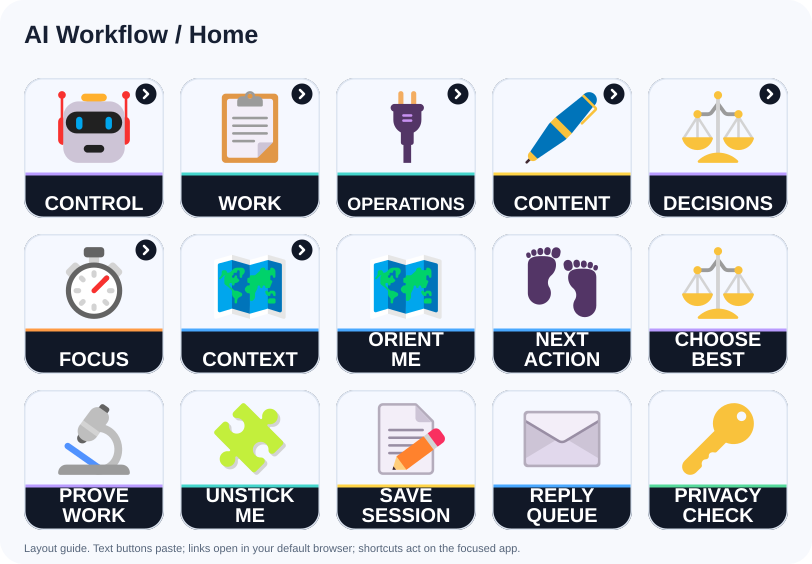
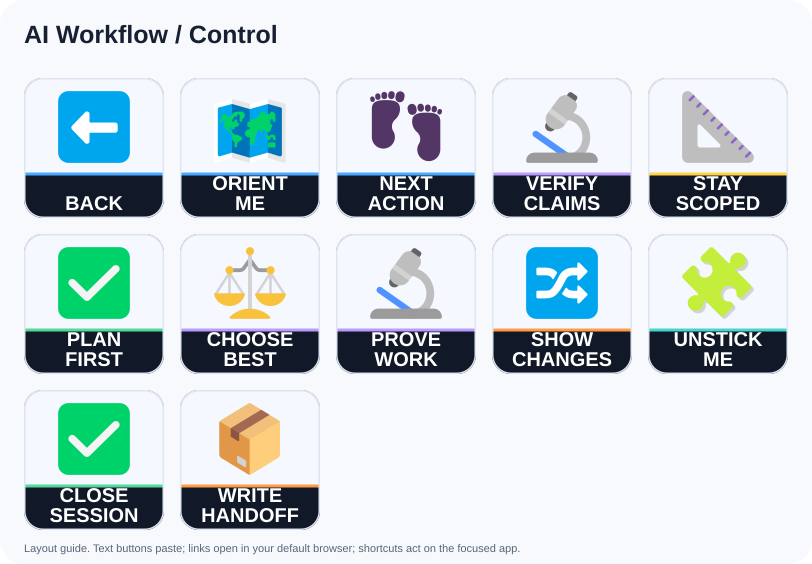
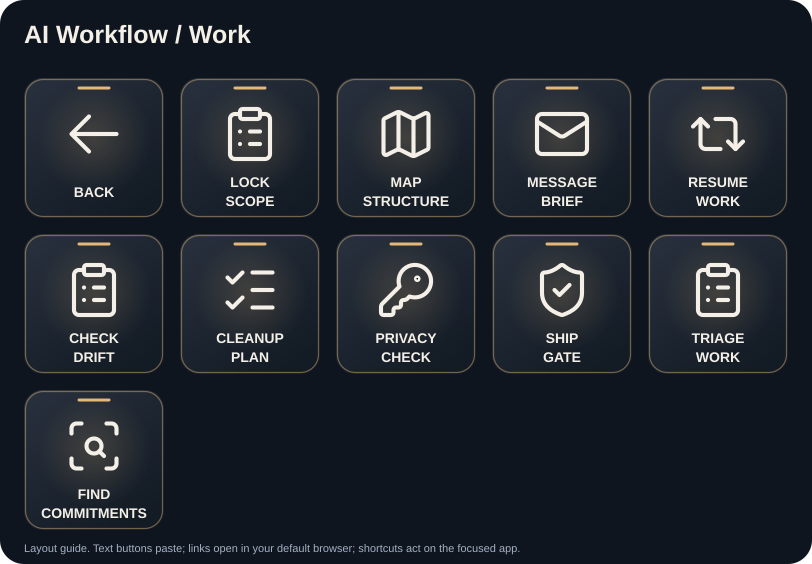
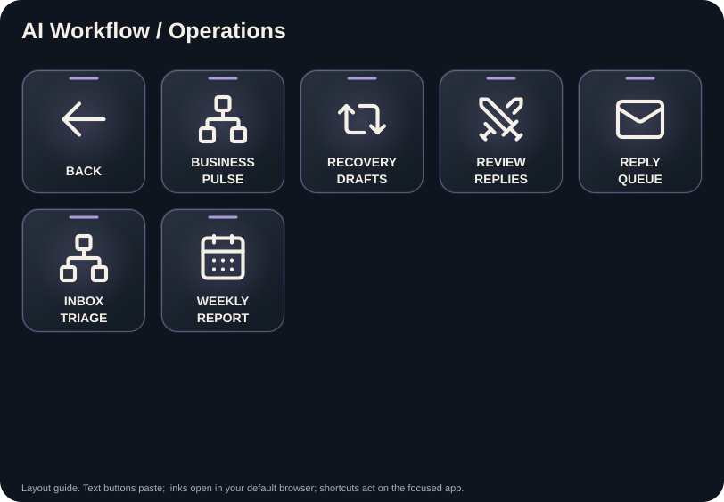
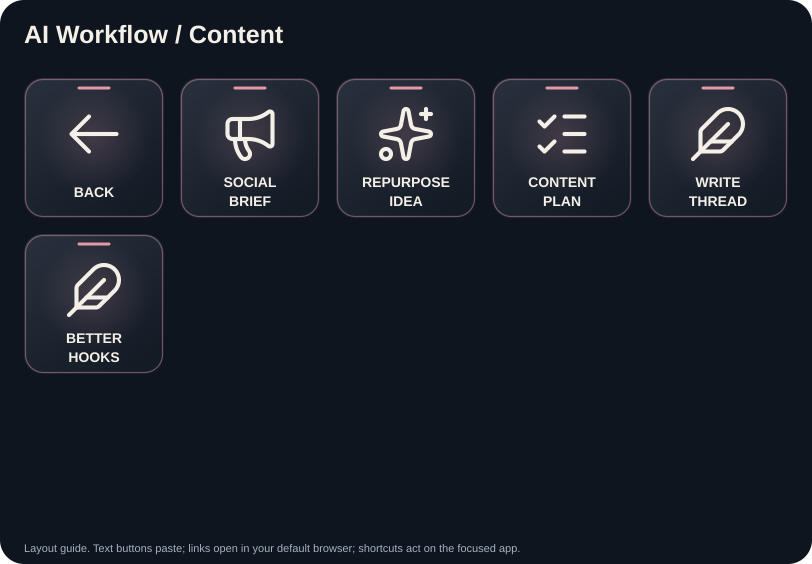
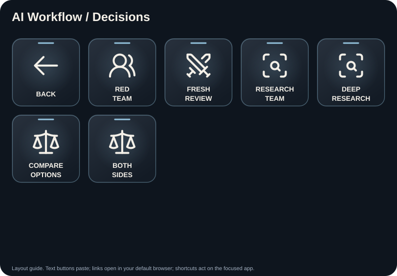
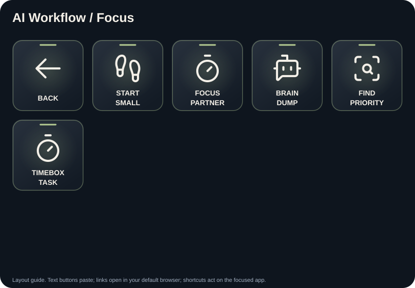
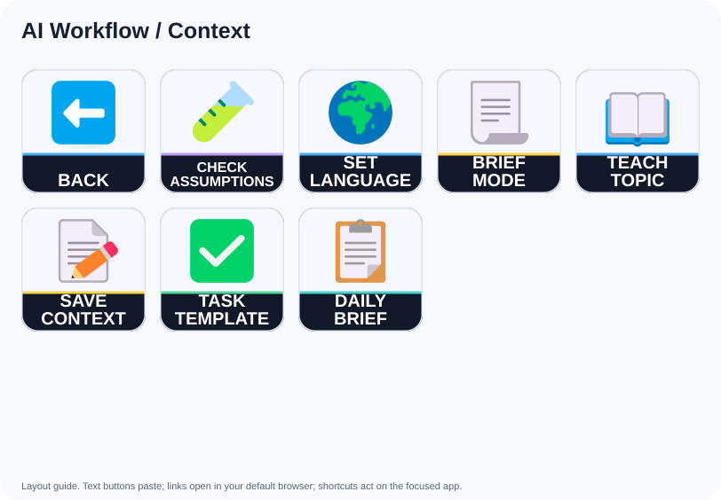

# AI Workflow: button guide

Provider-neutral prompts for AI chat: control the session, research decisions, organize work, draft content and recover focus.

Each prompt is prefixed with the shared scope, tool-availability and approval guard in `scripts/build.py`. Text buttons paste without Enter. Website buttons open the default browser; shortcut buttons act immediately on the focused application.

## Home

### ORIENT / ME: Orient Me

Button `2,1` (column,row; zero based).

Orient me. In under 10 lines: what is this session about so far, what's done, what's still open, and the single most valuable next action. No preamble.

### NEXT / ACTION: Next Action

Button `3,1` (column,row; zero based).

Give me exactly one next action. Not a list. Pick the highest-value move, tell me why in one line, then start it yourself if you can.

### CHOOSE / BEST: Choose Best

Button `4,1` (column,row; zero based).

Evaluate the options within our agreed scope, recommend the strongest one and state the main trade-off in one line. Start the first reversible, authorized step if you can. Ask if a personal preference materially changes the decision. Do not treat this prompt as approval to spend, publish, send messages, delete data or expand access.

### PROVE / WORK: Prove Work

Button `0,2` (column,row; zero based).

Prove your work actually works. Run it, test it, screenshot it, or diff it :  whatever fits. Show me evidence, not a claim. If something fails, fix it and prove it again.

### UNSTICK / ME: Unstick Me

Button `1,2` (column,row; zero based).

We're stuck. Do this in order:
1) Restate the actual goal in one line.
2) List what we tried and why each attempt failed.
3) Propose the 3 most DIFFERENT approaches :  not variations of the same idea.
4) Pick one and start it.

### SAVE / SESSION: Close and hand off the session

Button `2,2` (column,row; zero based).

Close this session properly:
1) What we accomplished.
2) Decisions made and why.
3) Open loops, each with an owner (you or me).
4) Anything only I can do.
Under 15 lines. Save anything durable to the project.

Then:

Write a handoff.md a fresh AI assistant session could run with: goal, current state, key file paths and links, decisions with reasons, next steps in order, and known traps. Assume zero memory of this chat. Save it to the project.

### REPLY / QUEUE: Reply Queue

Button `3,2` (column,row; zero based).

From the conversations I supply or explicitly authorize for [DATE RANGE], identify messages waiting on me. For each, state what is needed, the deadline if known, and a drafted reply in [TONE]. Prioritize by urgency and impact. Do not send anything.

### PRIVACY / CHECK: Privacy Check

Button `4,2` (column,row; zero based).

Leak scan before this goes out: check [DELIVERABLE] for anything that shouldn't leave this chat :  personal data, internal names, keys, real prices, client info, embarrassing leftovers, file metadata. List findings by severity and fix what's safe to fix.

## Control

### ORIENT / ME: Orient Me

Button `1,0` (column,row; zero based).

Orient me. In under 10 lines: what is this session about so far, what's done, what's still open, and the single most valuable next action. No preamble.

### NEXT / ACTION: Next Action

Button `2,0` (column,row; zero based).

Give me exactly one next action. Not a list. Pick the highest-value move, tell me why in one line, then start it yourself if you can.

### VERIFY / CLAIMS: Verify Claims

Button `3,0` (column,row; zero based).

Standing rule for this session: never answer from memory when a tool can verify. Check the actual file, message, or data before claiming anything. If you can't verify something, mark it "unverified" next to the claim.

### STAY / SCOPED: Stay Scoped

Button `4,0` (column,row; zero based).

Standing rule: stay inside the scope we agreed. If you spot something outside scope worth doing, add it to a "LATER" list instead of doing it. Show me the LATER list only when the main task is done.

### PLAN / FIRST: Plan First

Button `0,1` (column,row; zero based).

Before touching any files or tools: give me the plan in max 8 bullets :  what you'll change, what you WON'T touch, the risks, and how we'll verify it worked. Wait for my go.

### CHOOSE / BEST: Choose Best

Button `1,1` (column,row; zero based).

Evaluate the options within our agreed scope, recommend the strongest one and state the main trade-off in one line. Start the first reversible, authorized step if you can. Ask if a personal preference materially changes the decision. Do not treat this prompt as approval to spend, publish, send messages, delete data or expand access.

### PROVE / WORK: Prove Work

Button `2,1` (column,row; zero based).

Prove your work actually works. Run it, test it, screenshot it, or diff it :  whatever fits. Show me evidence, not a claim. If something fails, fix it and prove it again.

### SHOW / CHANGES: Show Changes

Button `3,1` (column,row; zero based).

Show me exactly what changed. Before vs after, item by item. Flag anything you changed that I didn't ask for.

### UNSTICK / ME: Unstick Me

Button `4,1` (column,row; zero based).

We're stuck. Do this in order:
1) Restate the actual goal in one line.
2) List what we tried and why each attempt failed.
3) Propose the 3 most DIFFERENT approaches :  not variations of the same idea.
4) Pick one and start it.

### CLOSE / SESSION: Close Session

Button `0,2` (column,row; zero based).

Close this session properly:
1) What we accomplished.
2) Decisions made and why.
3) Open loops, each with an owner (you or me).
4) Anything only I can do.
Under 15 lines. Save anything durable to the project.

### WRITE / HANDOFF: Write Handoff

Button `1,2` (column,row; zero based).

Write a handoff.md a fresh AI assistant session could run with: goal, current state, key file paths and links, decisions with reasons, next steps in order, and known traps. Assume zero memory of this chat. Save it to the project.

## Work

### LOCK / SCOPE: Lock Scope

Button `1,0` (column,row; zero based).

Before we build anything: interview me with ONE grouped set of questions (max 5) to lock the spec :  goal, audience, must-haves, non-goals, deadline. Then write the locked spec back in under 20 lines and treat it as the contract for this project.

### MAP / STRUCTURE: Map Structure

Button `2,0` (column,row; zero based).

Audit the structure of [PROJECT / FOLDER]. Map what exists, flag duplicates, dead files, misplaced items, and naming inconsistencies. Propose the cleaned target structure and the exact move plan. Don't move anything yet.

### MESSAGE / BRIEF: Message Brief

Button `3,0` (column,row; zero based).

Summarize the conversations I supply or explicitly authorize. Scope: [CONVERSATIONS/DATE RANGE]. For each, report what happened, what is waiting on me and a drafted reply where needed. Put urgent items first, avoid unnecessary personal details and send nothing.

### RESUME / WORK: Resume Work

Button `4,0` (column,row; zero based).

Resume work. Check the project docs and any handoff notes first. Tell me in 5 lines where we left off, then continue the highest-priority open item without waiting for me.

### CHECK / DRIFT: Check Drift

Button `0,1` (column,row; zero based).

Drift check: compare what our docs and plans SAY against what actually EXISTS (files, store, live site :  whatever applies). List every mismatch, worst first. Per item, either fix the doc or flag the work :  your call.

### CLEANUP / PLAN: Cleanup Plan

Button `1,1` (column,row; zero based).

Deadweight sweep of [SCOPE]: find what's unused, outdated, duplicated, or abandoned. For each item: keep / archive / delete, with a one-line reason. Prepare the cleanup but delete nothing without my confirm.

### PRIVACY / CHECK: Privacy Check

Button `2,1` (column,row; zero based).

Leak scan before this goes out: check [DELIVERABLE] for anything that shouldn't leave this chat :  personal data, internal names, keys, real prices, client info, embarrassing leftovers, file metadata. List findings by severity and fix what's safe to fix.

### SHIP / GATE: Ship Gate

Button `3,1` (column,row; zero based).

Ship gate. Run the final checklist on [DELIVERABLE]: correctness, broken links, names and numbers verified, formatting on mobile, tone, and one full end-to-end test. Verdict: SHIP, or the list of blockers. Be strict :  you are the last gate.

### TRIAGE / WORK: Triage Work

Button `4,1` (column,row; zero based).

Using this chat and the task sources I explicitly authorize, sort current work into DO TODAY, PREPARE A DRAFT, SCHEDULE and DEFER. Explain the top priority. Start one reversible, authorized preparation step if possible. Scheduling, sending, publishing and destructive changes require separate approval.

### FIND / COMMITMENTS: Find Commitments

Button `0,2` (column,row; zero based).

Review only the messages I supply or explicitly authorize for [DATE RANGE]. Find promises, expectations and deadlines. Return a table with commitment, person or team, due date, status and suggested next action. Draft any needed replies. Do not search unrelated accounts or send messages.

## Operations

### BUSINESS / PULSE: Business Pulse

Button `1,0` (column,row; zero based).

Using the business data I supply or explicitly authorize, summarize recent orders, abandoned carts, stock issues and reviews for [DATE RANGE]. Identify the three actions that need attention, with evidence. Prepare the highest-value draft or analysis. Do not contact customers or change orders, stock, prices or accounts.

### RECOVERY / DRAFTS: Recovery Drafts

Button `2,0` (column,row; zero based).

For the abandoned-cart data I supply or explicitly authorize for [DATE RANGE], summarize customer reference, cart value and items. Draft one short, helpful recovery message per eligible prospect in [LANGUAGE/TONE]. Use only approved offers. Mask personal details in shared reports and show the batch for approval. Send nothing.

### REVIEW / REPLIES: Review Replies

Button `3,0` (column,row; zero based).

From the reviews I supply or explicitly authorize, draft a reply to each in [LANGUAGE/TONE]. Thank positive reviewers, acknowledge problems and propose only fixes the business can actually provide. Flag reviews that need a human decision. Present the full batch for approval and post nothing.

### REPLY / QUEUE: Reply Queue

Button `4,0` (column,row; zero based).

From the conversations I supply or explicitly authorize for [DATE RANGE], identify messages waiting on me. For each, state what is needed, the deadline if known, and a drafted reply in [TONE]. Prioritize by urgency and impact. Do not send anything.

### INBOX / TRIAGE: Inbox Triage

Button `0,1` (column,row; zero based).

Triage my authorized inbox or the messages I supply for the last [DAYS] days. Separate noise, actions, deadlines and money-related items. Draft replies where useful. Propose archive or label changes in one table. Do not archive, send, or change messages until I approve the batch.

### WEEKLY / REPORT: Weekly Report

Button `1,1` (column,row; zero based).

Using the sales data I supply or explicitly authorize, compare [THIS PERIOD] with [COMPARISON PERIOD]: revenue, units, top products and material changes. Explain what the evidence supports and what is uncertain. Include one useful chart if supported. End with the highest-value action for the next period.

## Content

### SOCIAL / BRIEF: Social Brief

Button `1,0` (column,row; zero based).

Turn the attached news or source notes into a social content brief using [BRAND/TONE]: a feed post, a story and a carousel outline. Specify copy, dimensions, source attribution and image direction for each. If image tools and approved brand assets are available, prepare review exports; otherwise deliver a usable production brief. Do not claim images were rendered unless they were. Do not publish.

### REPURPOSE / IDEA: Repurpose Idea

Button `2,0` (column,row; zero based).

Take this one idea: [IDEA or pasted content]. Repurpose it into 5 native formats: X thread, IG carousel outline, 45-second video script, LinkedIn post, WhatsApp broadcast blurb. Each rebuilt for its platform, not copy-pasted. My voice.

### CONTENT / PLAN: Content Plan

Button `3,0` (column,row; zero based).

Plan next week's content from [LINKS/NOTES]. Propose the platform, date, time in [TIME ZONE], draft copy and asset requirements. Check for repetition and unsupported claims. Present the complete calendar for approval. Schedule only after explicit approval and only if an authorized scheduling tool is available; otherwise provide a ready-to-use calendar.

### WRITE / THREAD: Write Thread

Button `4,0` (column,row; zero based).

Write a thread on [TOPIC] in [LANGUAGE/TONE] for [AUDIENCE]. Generate ten genuinely different hooks, choose the strongest with a one-line reason, then write six to ten posts. Check factual claims against the supplied sources or available research tools. Keep each post useful on its own and end with one relevant next step. Draft only.

### BETTER / HOOKS: Better Hooks

Button `0,1` (column,row; zero based).

Give me 10 hooks for [CONTENT/TOPIC] :  10 genuinely different angles (curiosity, contrarian, number, story, fear, question, result...). Rank them, pick the winner, and write the first 3 lines that follow it.

## Decisions

### RED / TEAM: Red Team

Button `1,0` (column,row; zero based).

Red-team this: [PLAN / DRAFT / DECISION]. Attack it like a smart rival who wants it to fail :  weakest assumptions, what breaks first, what I'm not seeing, worst realistic scenario. Then give me the 2 fixes that most reduce the risk.

### FRESH / REVIEW: Fresh Review

Button `2,0` (column,row; zero based).

Independently verify the claims, numbers, links and conclusions in this chat. If a separate reviewer is available and authorized, provide only the necessary context and request a fresh review. Otherwise conduct a separate verification pass yourself and disclose that limitation. Report disagreements, missing evidence and unresolved uncertainty. Do not imply independent review happened if it did not.

### RESEARCH / TEAM: Research Team

Button `3,0` (column,row; zero based).

Research [TASK] through distinct perspectives, cross-check disputed findings and synthesize one answer. Use parallel agents only when supported and authorized; otherwise work through the perspectives sequentially. Cite the evidence and distinguish verified facts, inference and unknowns. Do not invent sources or tool access.

### DEEP / RESEARCH: Deep Research

Button `4,0` (column,row; zero based).

Deep research: [QUESTION]. Search wide, read the actual sources, separate facts from opinions, and note where sources disagree. Deliver a brief: answer first, then evidence, then sources. No padding.

### COMPARE / OPTIONS: Compare Options

Button `0,1` (column,row; zero based).

Compare [A] vs [B] (vs [C]) for [MY USE CASE]. Build the criteria yourself based on what actually matters for me, score them, declare a winner, and state the one reason I might regret it. Decision first, table second.

### BOTH / SIDES: Both Sides

Button `1,1` (column,row; zero based).

Steelman both sides of: [DECISION / CLAIM]. Strongest honest case for each, no strawmen. Then your verdict with the deciding factor. If it truly depends on my preference, give me the ONE question that settles it.

## Focus

### START / SMALL: Start Small

Button `1,0` (column,row; zero based).

I can't start. Break [TASK] into steps of 5 minutes or less. Then do step 1 for me right now :  completely :  and hand me step 2 ready to go.

### FOCUS / PARTNER: Focus Partner

Button `2,0` (column,row; zero based).

Body-double me for the next hour on [TASK]. I work, you keep a running checklist. Every time I message progress: check it off, give me the next micro-step, nothing else. Max 2 lines per reply.

### BRAIN / DUMP: Brain Dump

Button `3,0` (column,row; zero based).

Brain dump incoming :  my next message will be everything in my head, messy. Your job: sort it into projects, tasks, ideas, worries, and trash. Give every task a next action. Then tell me the ONE thing that matters most today.

### FIND / PRIORITY: Find Priority

Button `4,0` (column,row; zero based).

Look at everything on my plate (this chat + connected tools) and tell me: what's the frog :  the one task I'm avoiding that matters most? Then make starting it as easy as possible: prep the file, the draft, or the first step yourself.

### TIMEBOX / TASK: Timebox Task

Button `0,1` (column,row; zero based).

Timebox: we have 25 minutes for [TASK]. Cut scope to what fits, tell me what we're NOT doing, then go. If we run short, ship a smaller complete thing :  never a bigger broken one.

## Context

### CHECK / ASSUMPTIONS: Check Assumptions

Button `1,0` (column,row; zero based).

Before you continue: list every assumption you're making about what I want, ranked by how bad it is if you're wrong. Confirm the top 2 with me in one grouped question, then proceed.

### SET / LANGUAGE: Set Language

Button `2,0` (column,row; zero based).

For this conversation, use [LANGUAGE/DIALECT] and [TONE]. Keep replies short, clear and natural, with familiar wording. Preserve exact code, commands, names and numbers. If these preferences are missing, ask for them once.

### BRIEF / MODE: Brief Mode

Button `3,0` (column,row; zero based).

Switch to TL;DR mode for the rest of this chat: max 5 lines per answer, decision first, no background unless I ask for it.

### TEACH / TOPIC: Teach Topic

Button `4,0` (column,row; zero based).

Teach me [TOPIC] for [MY ROLE/CONTEXT]: what it means, why it matters, the few ideas that do most of the work and one concrete example. Define necessary technical terms plainly. Check uncertain or changing facts when research tools are available, and state what remains unverified.

### SAVE / CONTEXT: Save Context

Button `0,1` (column,row; zero based).

Save this properly: write what we just produced or decided into the project as a clean doc a future session can use. Clear name, context, decisions, open items. Confirm the path when done.

### TASK / TEMPLATE: Task Template

Button `1,1` (column,row; zero based).

Prepare a scheduled-task proposal for [WHAT], [DATE/TIME] and [TIME ZONE]. Write a self-contained prompt with the goal, authorized data sources, expected output, limits and failure behavior. Show the schedule and prompt for approval. Create it only after approval and only if a scheduling tool is available; otherwise provide manual setup steps.

### DAILY / BRIEF: Daily Brief

Button `2,1` (column,row; zero based).

Prepare a morning brief from the calendar, messages and business data I supply or explicitly authorize. Show today's commitments, urgent actions, important changes and the one priority that matters most. Use [TIME ZONE]. Label inaccessible sources and do not invent missing information. Draft replies where useful, but send nothing.
