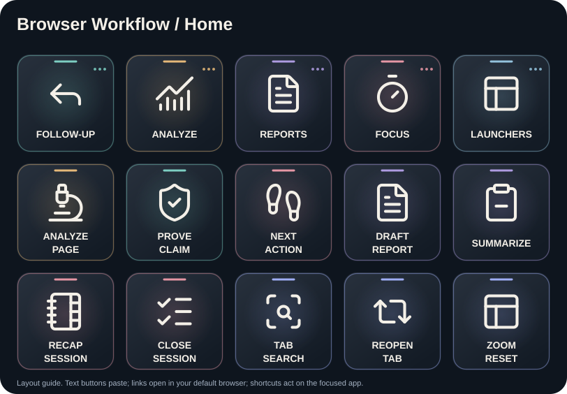
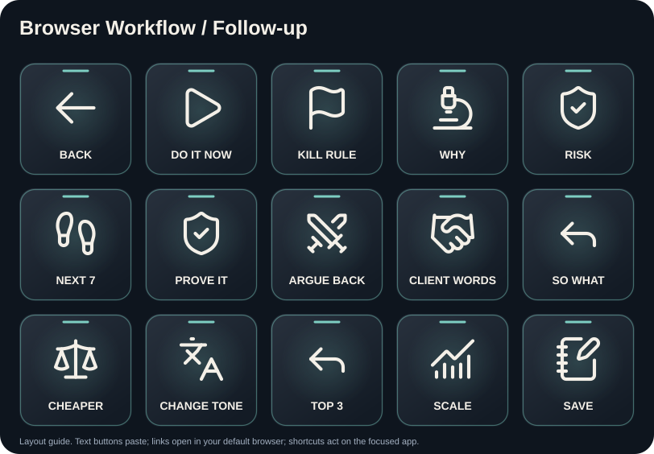
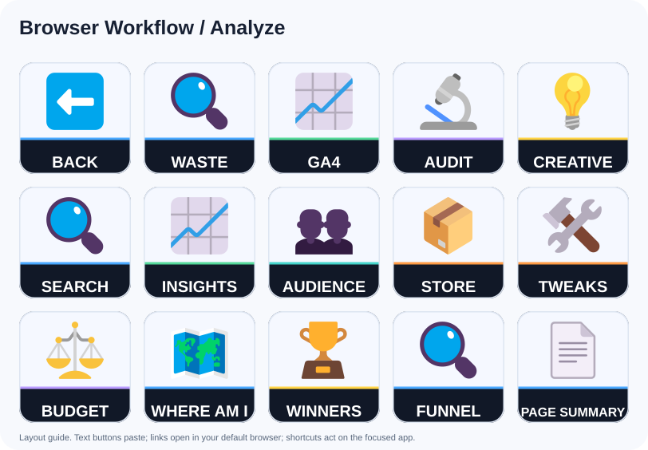
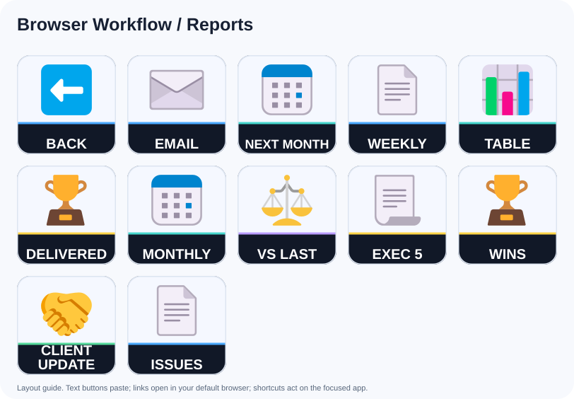
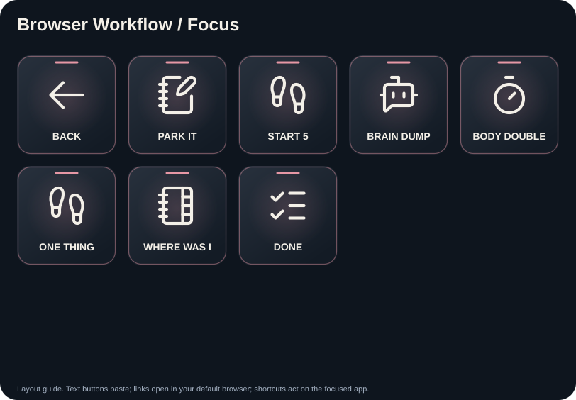
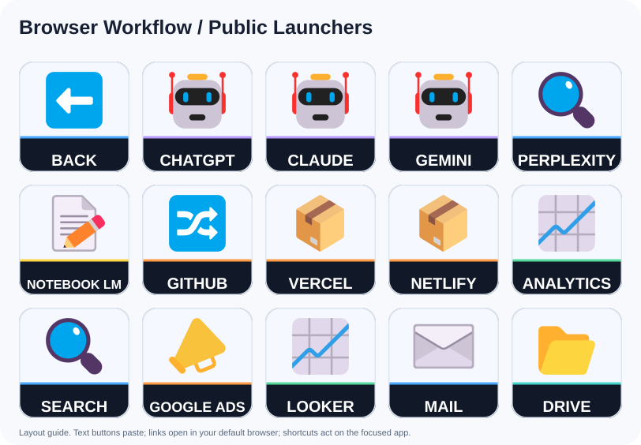

# Browser Workflow: button guide

Browser analysis, reporting, focus and public service launchers.

Each prompt is prefixed with the shared scope, tool-availability and approval guard in `scripts/build.py`. Text buttons paste without Enter. Website buttons open the default browser; shortcut buttons act immediately on the focused application.

## Home

### ANALYZE / PAGE: Audit

Button `0,1` (column,row; zero based).

Read the campaign data on this page. Give me: what's working, what's wasting money, and what's about to break. Use only numbers visible on screen - no assumptions. If a number I'd need is missing, say which one and where to find it.

### PROVE / CLAIM: Prove It

Button `1,1` (column,row; zero based).

Point to the exact rows, columns, and values on screen that support each claim. If you can't point to one, retract the claim.

### NEXT / ACTION: One Thing

Button `2,1` (column,row; zero based).

From everything on this screen, what is the single next action? Not a list. One action, one sentence, starting with a verb.

### DRAFT / REPORT: Weekly

Button `3,1` (column,row; zero based).

Build this week's report for [CLIENT] from the data on screen. Sections: headline result, spend vs return, what we changed, what we learned, next week. Numbers only from this page.

### SUMMARIZE: Exec 5

Button `4,1` (column,row; zero based).

Five lines for someone who will not read more than five lines: result, spend, best channel, biggest problem, what we're doing about it.

### RECAP / SESSION: Where Was I

Button `0,2` (column,row; zero based).

Recap this session: what I was doing, what I decided, what's unfinished, and the exact next click.

### CLOSE / SESSION: Done

Button `1,2` (column,row; zero based).

Close out this session. Give me: what got done, what didn't, the one thing to start with tomorrow. Then stop - no encouragement, no summary of the summary.

### TAB / SEARCH

Button `2,2`: tab-search.

### REOPEN / TAB

Button `3,2`: reopen-tab.

### ZOOM / RESET

Button `4,2`: zoom-reset.

## Follow-up

### DO IT NOW: Do It Now

Button `1,0` (column,row; zero based).

One change. The one I can make in the next 10 minutes on this screen that moves the most money. Just that one, with the clicks.

### KILL RULE: Kill Rule

Button `2,0` (column,row; zero based).

Write kill criteria: exact metric, exact threshold, exact number of days. Something I can check in 30 seconds without thinking.

### WHY: Why

Button `3,0` (column,row; zero based).

Why that conclusion? Walk me through the numbers you used, in order. If any step is inference rather than data, label it.

### RISK: Risk

Button `4,0` (column,row; zero based).

What breaks if I do this? Worst case, how likely, and the cheapest way to test it first.

### NEXT 7: Next 7

Button `0,1` (column,row; zero based).

Turn that into a 7-day plan. One action per day, each under 30 minutes. Day 1 starts today.

### PROVE IT: Prove It

Button `1,1` (column,row; zero based).

Point to the exact rows, columns, and values on screen that support each claim. If you can't point to one, retract the claim.

### ARGUE BACK: Argue Back

Button `2,1` (column,row; zero based).

Argue the opposite of what you just told me. Make the strongest case that I should do nothing. Then tell me which case is stronger and why.

### CLIENT WORDS: Client Words

Button `3,1` (column,row; zero based).

Rewrite that for the client. No jargon, no platform names they don't use, lead with the result. 6 lines max.

### SO WHAT: So What

Button `4,1` (column,row; zero based).

Convert that into decisions. Each one: do X, by when, expected result, how I'll know it worked.

### CHEAPER: Cheaper

Button `0,2` (column,row; zero based).

Same outcome, less spend. What's the low-budget version of that plan?

### CHANGE TONE: Change Tone

Button `1,2` (column,row; zero based).

Rewrite the previous answer in [LANGUAGE / TONE], concise and clear. Keep every fact and number accurate.

### TOP 3: Top 3

Button `2,2` (column,row; zero based).

Out of everything you just said, what are the 3 highest-impact actions? Rank by impact-to-effort and drop the rest.

### SCALE: Scale

Button `3,2` (column,row; zero based).

If this works, what's the scale-up sequence? Budget steps and the checkpoint at each.

### SAVE: Save

Button `4,2` (column,row; zero based).

Output the whole thread as one clean markdown block: context, findings, decisions, next actions. Ready to paste into a doc.

## Analyze

### WASTE: Waste

Button `1,0` (column,row; zero based).

Find the spend that isn't returning on this page. Give me a review list of proposed pauses with a threshold for each: kill if [metric] stays below [number] for [days]. Do not pause campaigns or change spend.

### GA4: Ga4

Button `2,0` (column,row; zero based).

Read this Analytics screen. What changed vs the previous period, which causes the evidence supports and which remain hypotheses, and what's noise? Ignore anything under [5]% movement.

### AUDIT: Audit

Button `3,0` (column,row; zero based).

Read the campaign data on this page. Give me: what's working, what's wasting money, and what's about to break. Use only numbers visible on screen - no assumptions. If a number I'd need is missing, say which one and where to find it.

### CREATIVE: Creative

Button `4,0` (column,row; zero based).

Judge the ad creative and copy visible here as a [TARGET AUDIENCE] would see it. Hook, clarity, offer, CTA, language quality. Score each out of 10 and rewrite the weakest one.

### SEARCH: Search

Button `0,1` (column,row; zero based).

Read this Search Console screen. Which queries are one small fix away from page 1, and what's the fix?

### INSIGHTS: Insights

Button `1,1` (column,row; zero based).

From this page, give me the 5 non-obvious things a good media buyer would notice and a junior would miss. One line each, each tied to a specific number on screen.

### AUDIENCE: Audience

Button `2,1` (column,row; zero based).

Read the targeting setup on this screen. Where is it too broad, too narrow, or overlapping with another ad set?

### STORE: Store

Button `3,1` (column,row; zero based).

Read this store dashboard. Orders, AOV, top products, drop-offs. What's the one lever worth pulling this week?

### TWEAKS: Tweaks

Button `4,1` (column,row; zero based).

List concrete changes I can make on this exact screen right now. For each: the change, where to click, expected effect, and risk. Rank by impact-to-effort. Max 7.

### BUDGET: Budget

Button `0,2` (column,row; zero based).

Check pacing on this page. Are we under- or over-spending vs the period? What should the budget be tomorrow, and why?

### WHERE AM I: Where Am I

Button `1,2` (column,row; zero based).

I just opened this page and lost the thread. In 4 lines: what am I looking at, what state is it in, what can be established about the next step, and what's the single next click.

### WINNERS: Winners

Button `2,2` (column,row; zero based).

Rank everything on this page by performance. Show the top 3 and tell me exactly why each is winning and whether it's scalable or a fluke.

### FUNNEL: Funnel

Button `3,2` (column,row; zero based).

Open the destination URL from this page and audit the landing experience against the ad promise. Where does the message break?

### PAGE SUMMARY: Page Summary

Button `4,2` (column,row; zero based).

Summarize this page in [LANGUAGE / TONE]: what works, what needs attention, and the next action. Use only visible evidence.

## Reports

### EMAIL: Email

Button `1,0` (column,row; zero based).

Client email draft: subject line, 3 short paragraphs, one clear ask or next step. Warm, plain, no jargon.

### NEXT MONTH: Next Month

Button `2,0` (column,row; zero based).

Write next month's plan: 3 initiatives, budget split, and the single metric that defines success.

### WEEKLY: Weekly

Button `3,0` (column,row; zero based).

Build this week's report for [CLIENT] from the data on screen. Sections: headline result, spend vs return, what we changed, what we learned, next week. Numbers only from this page.

### TABLE: Table

Button `4,0` (column,row; zero based).

Extract every metric on this page into a clean markdown table: metric, this period, last period, % change, verdict (good/watch/bad).

### DELIVERED: Delivered

Button `0,1` (column,row; zero based).

List everything delivered this period, in client-facing language, suitable for attaching to an invoice.

### MONTHLY: Monthly

Button `1,1` (column,row; zero based).

Build the monthly report for [CLIENT] from the data on screen: headline result, spend vs return, what we changed, what we learned, a vs-last-month table, and one strategic recommendation with a reason.

### VS LAST: Vs Last

Button `2,1` (column,row; zero based).

Compare this period to the previous one. Only surface changes over [10]%. For each, one sentence on the likely cause.

### EXEC 5: Exec 5

Button `3,1` (column,row; zero based).

Five lines for someone who will not read more than five lines: result, spend, best channel, biggest problem, what we're doing about it.

### WINS: Wins

Button `4,1` (column,row; zero based).

Write the wins section. 3 wins, each with the number that proves it. No fluff wins.

### CLIENT / UPDATE: Client Update

Button `0,2` (column,row; zero based).

Draft a short client update in [LANGUAGE / TONE]: result first, what changed, and what happens next. Use only verified figures. Do not send.

### ISSUES: Issues

Button `1,2` (column,row; zero based).

Write the issues section. Each issue: what happened, impact in numbers, what we're doing, by when. Own it, don't hedge.

## Focus

### PARK IT: Park It

Button `1,0` (column,row; zero based).

Capture [THOUGHT] as a short note in this chat, then return me to the current task. Do not persist it elsewhere without approval.

### START 5: Start 5

Button `2,0` (column,row; zero based).

I have 5 minutes and no motivation. Look at this page and give me one thing I can finish in 5 minutes. Not a plan. One thing.

### BRAIN DUMP: Brain Dump

Button `3,0` (column,row; zero based).

I'm going to dump everything in my head. Sort it into: do now, do this week, delegate, delete. Don't ask questions until I stop typing.

### BODY DOUBLE: Body Double

Button `4,0` (column,row; zero based).

Help me focus on [TASK] for 25 minutes. Define one finish line and a five-minute checkpoint. Check in when I return; do not promise timed background messages without a supported, authorized reminder tool.

### ONE THING: One Thing

Button `0,1` (column,row; zero based).

From everything on this screen, what is the single next action? Not a list. One action, one sentence, starting with a verb.

### WHERE WAS I: Where Was I

Button `1,1` (column,row; zero based).

Recap this session: what I was doing, what I decided, what's unfinished, and the exact next click.

### DONE: Done

Button `2,1` (column,row; zero based).

Close out this session. Give me: what got done, what didn't, the one thing to start with tomorrow. Then stop - no encouragement, no summary of the summary.

## Public Launchers

### CHATGPT

Button `1,0`: https://chatgpt.com/.

### CLAUDE

Button `2,0`: https://claude.ai/.

### GEMINI

Button `3,0`: https://gemini.google.com/.

### PERPLEXITY

Button `4,0`: https://www.perplexity.ai/.

### NOTEBOOK LM

Button `0,1`: https://notebooklm.google.com/.

### GITHUB

Button `1,1`: https://github.com/.

### VERCEL

Button `2,1`: https://vercel.com/.

### NETLIFY

Button `3,1`: https://app.netlify.com/.

### ANALYTICS

Button `4,1`: https://analytics.google.com/.

### SEARCH

Button `0,2`: https://search.google.com/search-console/.

### GOOGLE ADS

Button `1,2`: https://ads.google.com/.

### LOOKER

Button `2,2`: https://lookerstudio.google.com/.

### MAIL

Button `3,2`: https://mail.google.com/.

### DRIVE

Button `4,2`: https://drive.google.com/.
