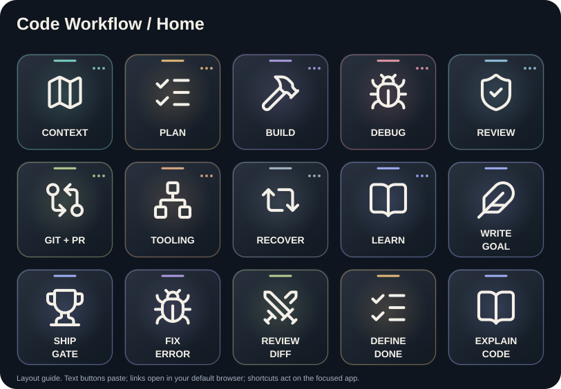
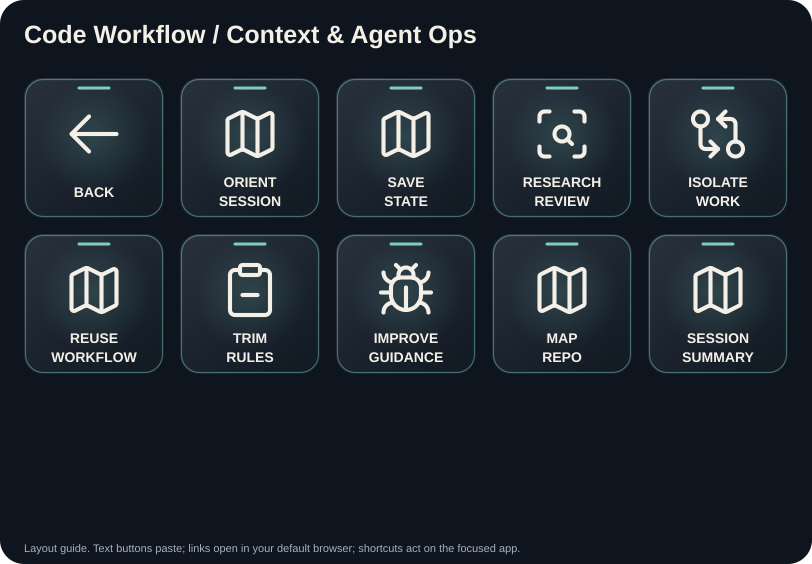
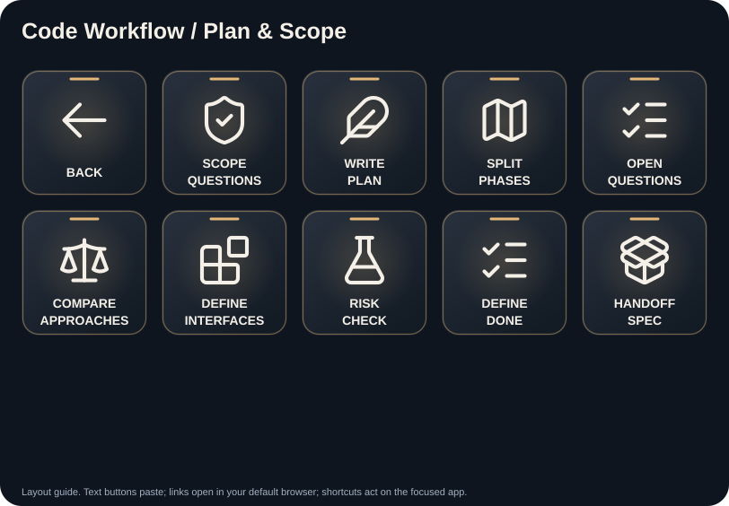
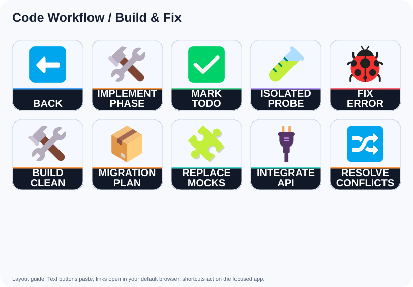
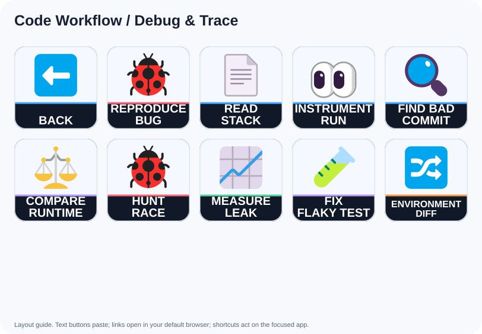
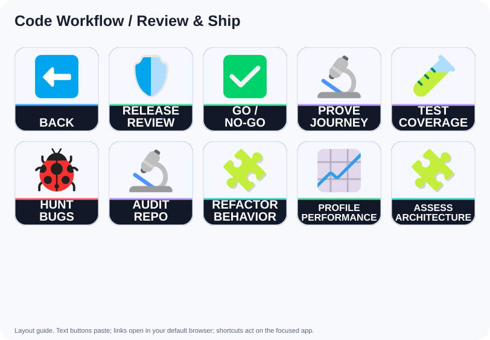
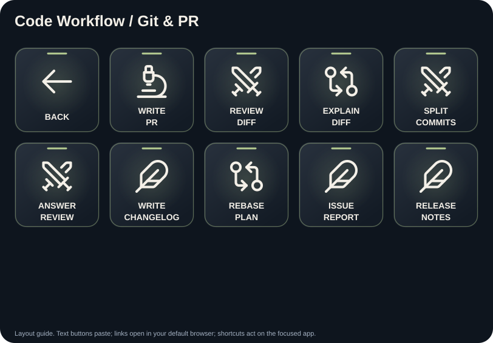
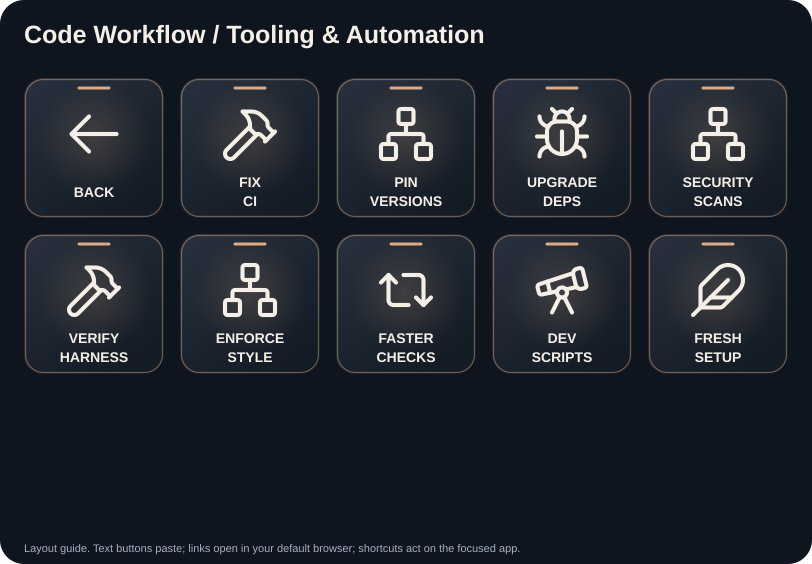
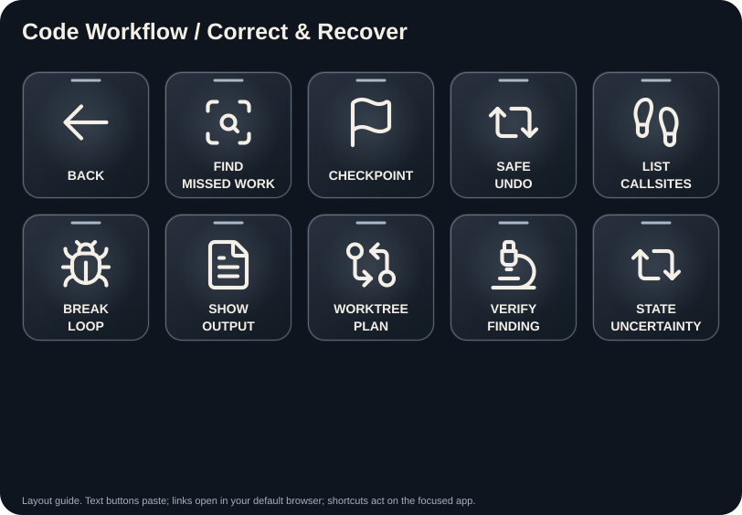
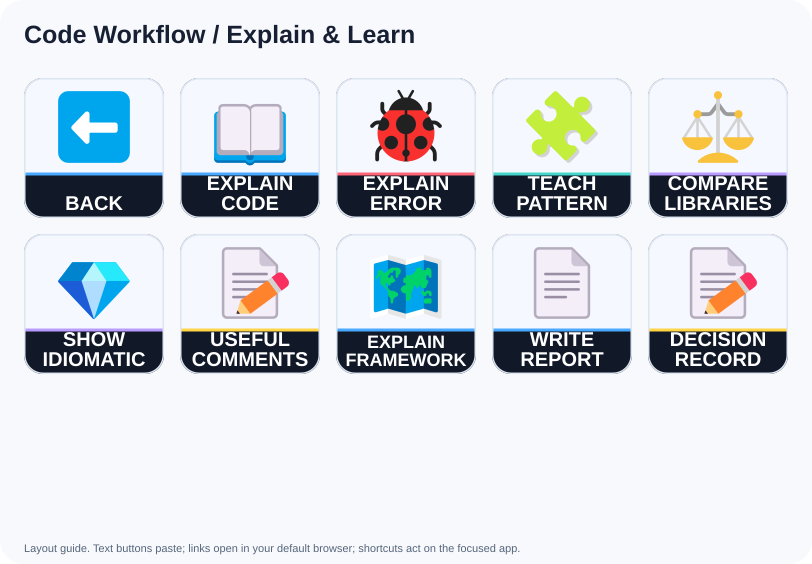

# Code Workflow: button guide

Coding-agent prompts for VS Code and other editors: understand, plan, build, debug, review, recover and hand off.

Each prompt is prefixed with the shared scope, tool-availability and approval guard in `scripts/build.py`. Text buttons paste without Enter. Website buttons open the default browser; shortcut buttons act immediately on the focused application.

## Home

### WRITE / GOAL: Write the goal without executing it

Button `4,1` (column,row; zero based).

From the source text or attachments I provide, write a goal in at most five sentences. Include the intended outcome, acceptance criteria, implementation scope, tests and final verification. Preserve constraints and exclusions. Do not inspect other repositories or start the work. Leave acceptance criteria unchecked. If a required source is missing, label the goal draft; otherwise label it ready for implementation. Provide it as an editable document.

### SHIP / GATE: Check release readiness

Button `0,2` (column,row; zero based).

Review this project for release readiness using its actual requirements and supported tools. Check the main user journey, loading and error states, security and privacy, configuration, dependencies, documentation, tests and build. Report only evidenced findings with severity and exact locations. Separate verified results from untested assumptions. Give a go/no-go recommendation. Do not deploy or publish.

### FIX / ERROR: Fix This Error And Show The Output

Button `1,2` (column,row; zero based).

Fix this error: read the exact message and stack, name the cause in one line, apply the smallest safe fix, then rerun and paste the real output, because a claim of success without output is not evidence. Do not suppress the warning, change nothing unrelated, and stop once it passes.

### REVIEW / DIFF: Adversarially Review This Diff

Button `2,2` (column,row; zero based).

Review this branch as a hostile reviewer whose only job is to find defects, in a fresh mindset, because the author of a change is the worst person to judge it. Rank findings by severity with file and line evidence, flag only what you can confirm, and do not edit anything yet.

### DEFINE / DONE: Define Done Before Any Code

Button `3,2` (column,row; zero based).

Define done before any code: the observable behaviors, the edge cases in scope, what is explicitly out of scope, and the exact command or check that proves each one, because acceptance criteria written afterwards always describe whatever got built. Write no code, and stop for approval.

### EXPLAIN / CODE: Explain This Code Like A Mentor

Button `4,2` (column,row; zero based).

Explain this code the way a patient senior would: what it does, why it is written this way, the patterns in play, and the two things most worth understanding deeply, because reading code you do not understand is how architectural debt lands. Cite the lines you mean, check them as you go, and edit nothing.

## Context & Agent Ops

### ORIENT / SESSION: Prime This Session Cold

Button `1,0` (column,row; zero based).

Read the rules file, the plan, the project structure, and the recent git log, then report the files you read, what you understand, and what you believe the next task is, because you have no prior context and I would rather correct your understanding than your diff. Change nothing else, and wait for my confirmation before you touch anything.

### SAVE / STATE: Externalize The State Before I Clear

Button `2,0` (column,row; zero based).

Write the current state to a file I can hand to a fresh session: what is done, what is in progress, the decisions and their reasons, open questions, and the exact next step, because I am about to clear this window and only the file survives. Report the path, change nothing else, and stop.

### RESEARCH / REVIEW: Send Subagents To Research, Not To Build

Button `3,0` (column,row; zero based).

Research this task and return findings with source paths. If independent research agents are available and their use is authorized, give them bounded read-only questions and reconcile disagreements. Otherwise do the research yourself and disclose the lack of an independent reviewer. Do not modify files or start implementation.

### ISOLATE / WORK: Set Up An Isolated Worktree

Button `4,0` (column,row; zero based).

Create a git worktree for this stream so it cannot collide with my other running agents, reinstall the project dependencies inside it, and confirm which worktree and branch you are in, because two agents in one directory overwrite each other. Save it as a reusable command, do not touch my other worktrees, and stop.

### REUSE / WORKFLOW: Turn This Into A Command Or Skill

Button `0,1` (column,row; zero based).

Turn this procedure into a reusable command or skill now that we have done it more than twice: the trigger, the exact steps, and the script that does the real work. Keep it out of the always-on rules file, because this knowledge is only needed sometimes. Report the path, change nothing else, and stop.

### TRIM / RULES: Trim The Always-On Rules File

Button `1,1` (column,row; zero based).

Audit the rules file line by line, because every line costs tokens on every single request. Move anything conditionally useful into an on-demand reference or a skill, keep only what is always true, and report the before and after line count. Delete nothing I have not approved, and stop.

### IMPROVE / GUIDANCE: Fix The AI Layer, Not Just The Bug

Button `2,1` (column,row; zero based).

Do not change any code. Given the mistake we just hit, tell me what to add to the rules, the spec, or the reference files so this whole class of mistake cannot recur, because fixing the instance leaves the cause in place. Check whether an existing rule already covers it, name the exact file for each change, change nothing else, and stop for my approval.

### MAP / REPO: Map This Repo For The Change

Button `3,1` (column,row; zero based).

Map this repository for the work ahead: entry points, the modules involved, the data flow, where the tests live, and every file this will touch. Cite a path and symbol for each claim and check every path exists, because an uncited map is a guess. End with the minimal execution plan, edit nothing, and stop.

### SESSION / SUMMARY: Summarize This Session For Tomorrow

Button `4,1` (column,row; zero based).

Summarize this session into a file: files touched, behavior changed, decisions and why, tests added, and what is still open, because tomorrow the question is not what this project does but what I was in the middle of. Report the path, add nothing else, and stop.

## Plan & Scope

### SCOPE / QUESTIONS: Interrogate Me Before You Plan

Button `1,0` (column,row; zero based).

Ask me the questions that would reshape your plan, as a numbered multiple-choice list, because every question I answer is an assumption you no longer have to invent. Check the repo first and skip anything it already answers. Cap it at the questions that actually change the plan and ask about nothing else. Do not plan or code yet; stop and wait for my answers.

### WRITE / PLAN: Write The Plan File With Validation First

Button `2,0` (column,row; zero based).

Write a plan document: goal, success criteria, non-goals, file-level tasks and the validation for each step. Verify existing paths; clearly label proposed new files. Save only the plan, report its location and stop before implementation.

### SPLIT / PHASES: Split This Into Context-Sized Phases

Button `3,0` (column,row; zero based).

Split this plan into numbered phases, each small enough to finish in one context window and each with an explicit completion condition, because a phase that outgrows its window is where instruction drift starts. Report the phase list and what each one leaves untouched, then stop.

### OPEN / QUESTIONS: List The Unresolved Questions

Button `4,0` (column,row; zero based).

List every question this plan still leaves open, ranked by how much damage a wrong guess would do, because the unresolved list is worth more than the confident parts. Check the repo for anything that already answers one, and say plainly where the data is insufficient instead of guessing. Change nothing else, and stop for my answers.

### COMPARE / APPROACHES: Compare Two Approaches And Decide

Button `0,1` (column,row; zero based).

Compare the two most viable approaches on complexity, blast radius, testability, and cost to reverse, because a decision without a reversal cost is a guess. Recommend one, name the single deciding factor, and report what evidence would flip it. Write no code yet, leave the repo untouched, and stop.

### DEFINE / INTERFACES: Lock The Data Structures And Interfaces

Button `1,1` (column,row; zero based).

Define the shapes first: data structures, interfaces, types, errors, and events, with usage examples you can run, because if the shapes are wrong nothing built on them can be right. Run one example to prove the shapes compile. Do not implement any behavior yet; stop for my approval, and change nothing else until the shapes are locked.

### RISK / CHECK: Rank The Riskiest Assumptions

Button `2,1` (column,row; zero based).

List the assumptions this plan rests on, ranked by risk, and for each one name the cheapest check that would prove or kill it, because an assumption nobody tested is a bug with a delay timer. Run the checks that cost nothing, report the output, change nothing else, and stop before acting on the rest.

### DEFINE / DONE: Define Done Before Any Code

Button `3,1` (column,row; zero based).

Define done before any code: the observable behaviors, the edge cases in scope, what is explicitly out of scope, and the exact command or check that proves each one, because acceptance criteria written afterwards always describe whatever got built. Write no code, and stop for approval.

### HANDOFF / SPEC: Write The Cold-Start Handoff Spec

Button `4,1` (column,row; zero based).

Write a spec another assistant can execute without this chat: context, goal, constraints, ordered tasks, acceptance criteria and exact verification commands. Verify existing paths and label new ones as proposed. Save only the spec, report its location and stop.

## Build & Fix

### IMPLEMENT / PHASE: Implement This Phase And Nothing Else

Button `1,0` (column,row; zero based).

Implement only the current phase of the plan, because scope that grows quietly is scope nobody reviewed. Follow the patterns already in this repo, leave unrelated code untouched, run the checks the plan names, and report the actual output plus every file you touched, and stop at the phase boundary.

### MARK / TODO: Mark Every TODO Before You Code

Button `2,0` (column,row; zero based).

Insert an explicit TODO marker at every location you intend to change, and report the list with paths and line numbers, because I would rather correct your map than your diff. Write no implementation yet, touch nothing else, and stop until I confirm the markers are right.

### ISOLATED / PROBE: Implement Then Revert And Report The Breaks

Button `3,0` (column,row; zero based).

Run a disposable implementation probe in a new isolated worktree or scratch directory. First verify the original worktree will remain untouched. Compare the result to the plan, document the assumptions that failed and show the probe diff. Do not merge, delete, or discard the probe without approval. Leave the original project unchanged.

### FIX / ERROR: Fix This Error And Show The Output

Button `4,0` (column,row; zero based).

Fix this error: read the exact message and stack, name the cause in one line, apply the smallest safe fix, then rerun and paste the real output, because a claim of success without output is not evidence. Do not suppress the warning, change nothing unrelated, and stop once it passes.

### BUILD / CLEAN: Make It Build And Run Clean

Button `0,1` (column,row; zero based).

Get this project building and running clean: run the build, read the errors in order, and fix them one at a time, because fixing the third error first usually invents work. Never silence a warning to make it pass. Paste the successful command output, change nothing else, and stop.

### MIGRATION / PLAN: Write The Migration With A Rollback

Button `1,1` (column,row; zero based).

Write this migration with its rollback in the same change: forward steps, reverse steps, backfill, and safety on existing rows, because a migration you cannot reverse is a decision you cannot undo. Run it dry and paste the output. Do not execute against real data, change nothing else, and stop for my approval.

### REPLACE / MOCKS: Replace The Mocks With Real Calls

Button `2,1` (column,row; zero based).

Replace every mock on this path with the real call, because a step validated on mocked data is a step nobody validated. Remove only what is genuinely mocked, list each one and what now runs instead, exercise the real path, and paste the output. If a credential is missing, say so and stop rather than re-mocking.

### INTEGRATE / API: Integrate This API From Its Current Docs

Button `3,1` (column,row; zero based).

Integrate this API from its current published docs, not from memory, because the version you remember is usually the one with the vulnerability: typed client, auth, timeouts, retries with backoff, and error mapping. Prove one real call and paste the response. Pin the version, leave unrelated code untouched, and stop.

### RESOLVE / CONFLICTS: Resolve These Conflicts By Intent

Button `4,1` (column,row; zero based).

Resolve these conflicts by working out what each side was trying to do, because deleting a hunk to make the merge pass silently discards someone's decision. Keep both behaviors where both are required, change nothing unrelated to the conflict, run the tests, paste the output, and stop before pushing.

## Debug & Trace

### REPRODUCE / BUG: Reproduce It End To End First

Button `1,0` (column,row; zero based).

Reproduce this bug end to end, the way a user actually hits it, before you change a single line, because a fix for a bug you never reproduced is a guess with a commit hash. Script the repro if you can, paste the output, report observed versus expected, change nothing else, and stop before editing.

### READ / STACK: Read This Stack Trace Precisely

Button `2,0` (column,row; zero based).

Read this stack trace precisely: which frame actually failed, what the frames around it were doing, and the likely causes ranked against each other, because the top frame is usually the victim and not the culprit. Name the first thing to check, change nothing else, and stop there.

### INSTRUMENT / RUN: Instrument, Run, Then Diagnose

Button `3,0` (column,row; zero based).

Add minimal targeted logging around the suspected path, run the failing scenario, and read the real output before forming a theory, because a diagnosis without instrumentation is just the most plausible story. Report the values you saw, remove the temporary logging, and stop before fixing.

### FIND BAD / COMMIT: Bisect To The Breaking Commit

Button `4,0` (column,row; zero based).

Find the commit that introduced this regression using bisect or history, with a fast repro check at each step, because narrowing to one commit turns a hunt into a diff. Report the commit and explain exactly what it broke. Do not fix it yet, change nothing else, and stop.

### COMPARE / RUNTIME: Compare Runtime State To Our Assumptions

Button `0,1` (column,row; zero based).

Inspect the real runtime state at the failure point, variable values, nulls, types, and collection sizes, then paste the values you actually saw and report where reality and our assumptions disagree, because bugs live in that gap. Do not edit anything, touch nothing else, and stop once the mismatch is named.

### HUNT / RACE: Hunt The Race Or Ordering Bug

Button `1,1` (column,row; zero based).

Hunt the race here: shared state, async ordering, awaited versus fire and forget, and locking, because an intermittent failure is an ordering assumption nobody wrote down. Demonstrate the interleaving that fails and paste the evidence. Propose the safest fix in scope, then stop.

### MEASURE / LEAK: Find And Measure The Leak

Button `2,1` (column,row; zero based).

Find the leak: trace allocations, subscriptions, listeners, timers, and handles created and never released across this repository, because a leak you cannot measure is a leak you cannot prove you fixed. Show the growth with numbers, fix only what you proved leaks, and stop.

### FIX / FLAKY TEST: Kill This Flake At The Root

Button `3,1` (column,row; zero based).

Kill this flaky test at its root cause, timing, ordering, shared state, or network, because adding a sleep converts a visible flake into an invisible one. Run it repeatedly and report the pass rate over those runs as evidence. Change nothing unrelated, and stop once it is stable.

### ENVIRONMENT / DIFF: Explain The Environment Difference

Button `4,1` (column,row; zero based).

Explain why this works in one environment and fails in another: compare versions, configuration, environment variables, paths, and data, because the decisive difference is always something we assumed was identical. Report the evidence, change nothing else, and stop once you can name it.

## Review & Ship

### RELEASE / REVIEW: Take This To Production Ready

Button `1,0` (column,row; zero based).

Take this repository to production ready: close the open issues, run tests, lint, and build, refresh the docs and changelog, and produce the exact safe ship commands, because a release assembled by hand is a release with a step missing. Paste the output, leave unrelated behavior untouched, and do not push or deploy without my approval.

### GO / / NO-GO: Give Me A Go Or No-Go

Button `2,0` (column,row; zero based).

Run a release readiness check across versioning, migrations, compatibility, secrets, configuration, packaging, tests, CI, rollback, observability, and docs, because a go decision without a rollback plan is a hope. Report a go or no-go with the blocking items named, change nothing else, and stop.

### PROVE / JOURNEY: Prove The Journey With Real Evidence

Button `3,0` (column,row; zero based).

Prove the user journey end to end through the real entry point, real persistence, and the visible outcome, because a passing unit test is not evidence that the product works. Capture a screenshot, recording, or log as proof, list every boundary you could not exercise, change nothing else, and stop before fixing.

### TEST / COVERAGE: Run The Test Blitz Repo Wide

Button `4,0` (column,row; zero based).

Design and run a repository-wide test blitz across unit, integration, regression, error-path, and smoke coverage, because a suite that only covers the new code cannot catch what the new code broke. Before you fix anything, report the failure list ordered by blast radius; then fix only what is in scope and show the passing output.

### HUNT / BUGS: Hunt The Bugs No Test Covers

Button `0,1` (column,row; zero based).

Hunt for the bugs no test covers across this repository: invariants, error paths, state transitions, concurrency, resource cleanup, and boundary inputs, because the tests encode what we already thought of. Reproduce and rank each issue with evidence, fix only what is in scope, and stop.

### AUDIT / REPO: Audit The Repo For Security Risks

Button `1,1` (column,row; zero based).

Audit this repository for authentication, authorization, input validation, injection, secrets, privacy, dependency, and error-leak risks, because the surface you did not audit is the one that ships. Rank concrete findings with paths, run the checks you can and paste the output, propose a fix for each, change nothing unrelated, and do not change auth or secrets without my approval.

### REFACTOR / BEHAVIOR: Refactor With Behavior Locked

Button `2,1` (column,row; zero based).

Refactor for clarity and maintainability without changing behavior: lock the current behavior with a test first, then simplify structure, names, and duplication one module at a time, because a refactor without a lock is a rewrite with optimism. Prove parity by running both, and stop.

### PROFILE / PERFORMANCE: Profile Then Fix The Real Bottleneck

Button `3,1` (column,row; zero based).

Profile before you optimize anything, because the bottleneck is almost never where it feels like it is. Quantify the cost, propose the lowest-risk improvement, apply only what you measured, and report the before and after numbers. Do not make speculative changes, and stop once it is measured.

### ASSESS / ARCHITECTURE: Assess The Architecture Honestly

Button `4,1` (column,row; zero based).

Assess this architecture against the goal and the constraints: map dependencies and data flow, compare the alternatives, and propose the smallest sustainable evolution with migration and rollback steps, because a rewrite proposed without a payoff is ambition. Record it as an ADR, check every path you cite, change no code, and stop.

## Git & PR

### WRITE / PR: Write The PR Body With Evidence

Button `1,0` (column,row; zero based).

Write the PR body for every change on this branch: original intent, what changed, how it was tested, links to the evidence, and the risk level, because a reviewer who has to reconstruct intent reviews the diff and not the decision. Cite real paths, add nothing else, and do not push.

### REVIEW / DIFF: Adversarially Review This Diff

Button `2,0` (column,row; zero based).

Review this branch as a hostile reviewer whose only job is to find defects, in a fresh mindset, because the author of a change is the worst person to judge it. Rank findings by severity with file and line evidence, flag only what you can confirm, and do not edit anything yet.

### EXPLAIN / DIFF: Walk Me Through This Diff Hunk By Hunk

Button `3,0` (column,row; zero based).

Walk me through all the changes on this branch file by file: what each hunk does, why it is needed, and which hunks deserve a second pair of eyes, because the risky hunk is rarely the biggest one. Show the diffstat output first, flag only what is real, and do not edit anything.

### SPLIT / COMMITS: Split This Into Reviewable Commits

Button `4,0` (column,row; zero based).

Split this work into commits a human can actually review: one logical change each, conventional messages, unrelated edits excluded, because a single blob commit is a review nobody performs. Report the planned sequence and run the checks. Do not push or merge without my approval.

### ANSWER / REVIEW: Answer Every Review Comment

Button `0,1` (column,row; zero based).

Answer every open review comment: agree and fix, or disagree with a technical reason, because an unanswered comment reads as ignored. Keep replies short and specific, run the checks after each fix, and report the output. Leave unrelated code untouched, and do not merge.

### WRITE / CHANGELOG: Write The Changelog Entry

Button `1,1` (column,row; zero based).

Write the changelog entry for all the changes on this branch, in this project's existing style: user-visible impact first, breaking changes flagged, migration notes where they apply, because a changelog written for maintainers helps nobody. Check each claim against the code, add nothing else, then stop.

### REBASE / PLAN: Plan A Rebase

Button `2,1` (column,row; zero based).

Inspect the working tree, current branch, configured remote and locally available default-branch reference. State if the reference may be stale. Identify likely conflicts and unrelated commits, then propose the exact rebase steps, recovery path and validation commands. Preserve uncommitted work. Do not fetch, rebase, resolve conflicts, rewrite history, force-push or merge until I approve the plan.

### ISSUE / REPORT: Write The Minimal Issue Report

Button `3,1` (column,row; zero based).

Write a minimal, complete issue report for this bug: title, environment, steps, expected versus actual, the smallest reproduction, and the suspected area, because an issue nobody can reproduce is a note to self. Confirm the repro by running it, paste the output, change nothing else, and stop.

### RELEASE / NOTES: Write Release Notes For Humans

Button `4,1` (column,row; zero based).

Write release notes for humans from all the changes since the last release: what users gain, what behavior moved, upgrade steps, and known issues, because internal jargon in release notes is a support ticket waiting to happen. Check every claim against the shipped code, add nothing else, then stop.

## Tooling & Automation

### FIX / CI: Fix The Failing CI Run

Button `1,0` (column,row; zero based).

Fix this CI run: read the actual log, find the first real failure rather than the downstream noise, reproduce it locally, then fix it, because chasing the last error in the log fixes a symptom. Paste the passing run output, change nothing unrelated, and stop before merging.

### PIN / VERSIONS: Pin The Exact Current Versions

Button `2,0` (column,row; zero based).

Pin every dependency to an exact current version, checking what is actually published today rather than what you remember, because models reach for older packages and older packages carry known vulnerabilities. Report the pinned list and run the install. Do not change any major version here, touch nothing else, and stop.

### UPGRADE / DEPS: Upgrade Dependencies Without Breaking

Button `3,0` (column,row; zero based).

Upgrade the outdated dependencies in risk order, reading the breaking-change notes first and running the tests between every step, because a batch upgrade that fails tells you nothing about which package did it. Upgrade one package at a time, paste the output at each step, and stop at the first real break.

### SECURITY / SCANS: Turn On Scanning And Dependency Bots

Button `4,0` (column,row; zero based).

Turn on dependency and code scanning for this repository before the next merge, because a vulnerability found by a bot is cheaper than one found by a user. Report the exact configuration you added and run it once to confirm it reports. Do not change application code, touch nothing else, and stop.

### VERIFY / HARNESS: Build The Self-Verification Harness

Button `0,1` (column,row; zero based).

Build a harness that lets you exercise this product headlessly and check your own work, because an agent that cannot run the thing it changed is guessing. Make it one repeatable command, run it, and paste the output. Leave the existing tests untouched, do not weaken any assertion to make it pass, then stop.

### ENFORCE / STYLE: Enforce Style With Tools Not Prose

Button `1,1` (column,row; zero based).

Consolidate linting and formatting into tools that run in CI, generating configuration that matches this codebase's dominant style, because a style rule written in prose is a rule nobody enforces. Report what you suppressed and why, run the full check, leave unrelated files untouched, and do not change any logic.

### FASTER / CHECKS: Speed Up The Feedback Loop

Button `2,1` (column,row; zero based).

Measure the current build, test, and reload times, find the dominant cost, and apply only the highest-impact safe improvement, because a feedback loop slower than my attention span is the real bottleneck. Report the before and after numbers, change nothing unrelated, and stop there.

### DEV / SCRIPTS: Create The Missing Dev Scripts

Button `3,1` (column,row; zero based).

Create the developer scripts this repo is missing, run, test, lint, format, and clean, and wire them into the task configuration, because a command nobody can find gets reinvented wrong. Run each one, paste the output, document them in the README, add nothing else, and stop.

### FRESH / SETUP: Write Fresh Machine Setup Steps

Button `4,1` (column,row; zero based).

Write the exact setup steps for this project on a fresh Windows machine: prerequisites, install commands, environment variables, first run, and how to verify each step worked, because setup instructions nobody tested are fiction. Check each command against the repo, touch nothing else, and stop.

## Correct & Recover

### FIND / MISSED WORK: Find The Change You Did Not Finish

Button `1,0` (column,row; zero based).

List every place in this repository that should have changed alongside what you just edited but did not: callers, types, tests, config, docs, sibling modules, and error paths. Cite a path and symbol for each, because an uncited miss is only a guess. Report the list ranked by blast radius. Do not fix anything, change nothing else, and stop.

### CHECKPOINT: Checkpoint This Tree Before You Touch It

Button `2,0` (column,row; zero based).

Before editing, inspect the worktree and identify existing work. Propose a recoverable checkpoint for this task only. Do not stage unrelated files, secrets, or personal data. Create a branch or local checkpoint only within my authorization, and report its name and commit if created. Ask before pushing anywhere. Preserve all existing work.

### SAFE / UNDO: Revert Your Last Run Cleanly

Button `3,0` (column,row; zero based).

Prepare an undo of only the changes you made in this run. First show the exact diff and distinguish my pre-existing work or other agents' changes. Explain anything that cannot be recovered and ask before deleting or discarding data. Do not use a blanket reset or touch unrelated work. After approval, apply the scoped undo, verify it and stop.

### LIST / CALLSITES: Enumerate Every Callsite First

Button `4,0` (column,row; zero based).

Before changing this signature or shape, enumerate every callsite, import, test, mock, and serialized copy that depends on it, using exact symbol search rather than a semantic guess, because approximate retrieval misses the ones that matter. Paste the list with paths and line numbers, change nothing else, then stop.

### BREAK / LOOP: Break The Loop And Reset

Button `0,1` (column,row; zero based).

Stop retrying, because you have failed the same way more than twice. Write to a file what you attempted, the actual error output each time, and what you now believe is wrong, because the next attempt should start from that evidence in a clean window and not from this one. Do not edit, and change nothing else.

### SHOW / OUTPUT: Show Me The Output, Not The Summary

Button `1,1` (column,row; zero based).

Paste the proof of what you just claimed: the actual terminal output, screenshot, or file diff, because I do not accept a summary as evidence. If you did not run it, say so plainly before you continue. Name the exact command and the directory you ran it in, and add nothing else.

### WORKTREE / PLAN: Plan Parallel Worktrees

Button `2,1` (column,row; zero based).

Plan up to four independent work streams. Identify shared files, dependencies and likely collisions; propose a separate branch and worktree path for each stream, plus validation and merge order. If the work cannot be split safely, recommend sequential execution. Do not create branches or worktrees, launch agents, edit files or merge anything until I approve the plan.

### VERIFY / FINDING: Verify That Finding Three Ways

Button `3,1` (column,row; zero based).

Take the finding you just reported and try to disprove it three separate ways: reproduce it, read the code path that contradicts it, and check whether a test already covers it. Report which attempts failed to refute it, because a claim I cannot falsify is not worth acting on. Do not edit anything yet, change nothing else, and stop.

### STATE / UNCERTAINTY: Tell Me What You Are Not Sure About

Button `4,1` (column,row; zero based).

Before you continue, list what you are actually unsure about here: the assumptions you never validated, the files you never opened, and the claims you only inferred. If the data is insufficient, say so instead of guessing, because a confident wrong answer costs me hours. Report the list and change nothing else.

## Explain & Learn

### EXPLAIN / CODE: Explain This Code Like A Mentor

Button `1,0` (column,row; zero based).

Explain this code the way a patient senior would: what it does, why it is written this way, the patterns in play, and the two things most worth understanding deeply, because reading code you do not understand is how architectural debt lands. Cite the lines you mean, check them as you go, and edit nothing.

### EXPLAIN / ERROR: Explain This Error In Plain Language

Button `2,0` (column,row; zero based).

Explain this error in plain language: what the message actually means, the usual causes ranked, how to confirm which one applies here, and the canonical fix, because the message is written for the compiler author and not for me. Name the check that settles it, edit nothing else, and stop.

### TEACH / PATTERN: Teach The Pattern Behind This Code

Button `3,0` (column,row; zero based).

Teach me the pattern behind this code: the problem it solves, how this implementation applies it, when to reach for it, and when it is overkill, because a pattern applied without its problem is just ceremony. Show a short example you can run, edit nothing, and say plainly where you are unsure.

### COMPARE / LIBRARIES: Compare These Libraries For Our Case

Button `4,0` (column,row; zero based).

Compare the candidate libraries for our specific case on maturity, API fit, performance, dependency weight, and maintenance risk, because the popular choice and the right choice are different questions. Check the current published versions, recommend one as a short ranked list, install nothing, and stop.

### SHOW / IDIOMATIC: Show Me The Idiomatic Version

Button `0,1` (column,row; zero based).

Show me the idiomatic version of this code for this language and framework, as an experienced maintainer would write it, and explain each meaningful difference, because unidiomatic code costs a reader more than it saved the writer. Run it to confirm parity, apply nothing yet, edit nothing else, and stop.

### USEFUL / COMMENTS: Add Only High-Value Comments

Button `1,1` (column,row; zero based).

Add comments only where they carry intent, invariants, or a non-obvious decision, because a comment that restates the code is a second thing that can go stale. Never narrate what the line already says. Report the comments you added and why, change nothing else, and stop.

### EXPLAIN / FRAMEWORK: Explain The Framework Magic Here

Button `2,1` (column,row; zero based).

Explain what the framework is doing invisibly here: the lifecycle, injection, reactivity, or code generation involved, and trace one real request or render through it step by step, because magic you cannot trace is magic you cannot debug. Cite the framework source, check it as you go, and edit nothing.

### WRITE / REPORT: Write The Deep Markdown Report

Button `3,1` (column,row; zero based).

Write a deep report to a markdown file rather than to this chat, because a long answer in the window is an answer I lose at the next clear: the question, what you checked, the evidence with paths, the conclusion, and what remains uncertain. Report the file path, edit nothing else, and stop.

### DECISION / RECORD: Record This Decision As An ADR

Button `4,1` (column,row; zero based).

Record this decision as an ADR in the repo: the context, the options considered, the decision, the consequences, and what would cause us to revisit it, because a decision nobody wrote down gets relitigated every quarter. Check every path you cite, add nothing else, and stop.
