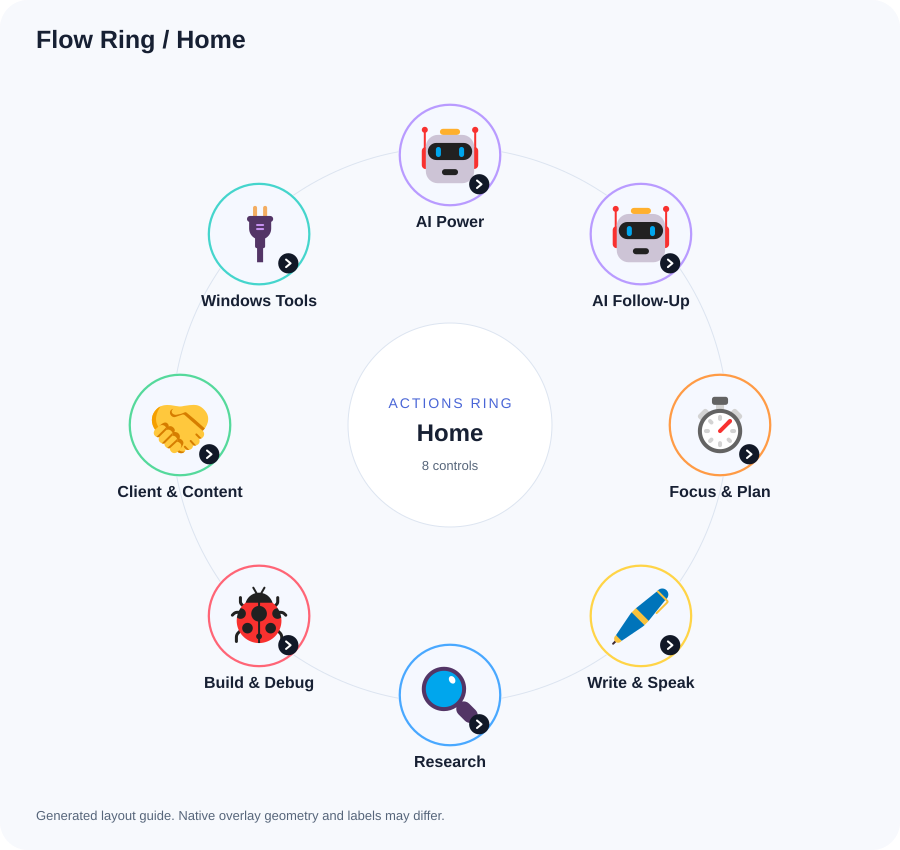
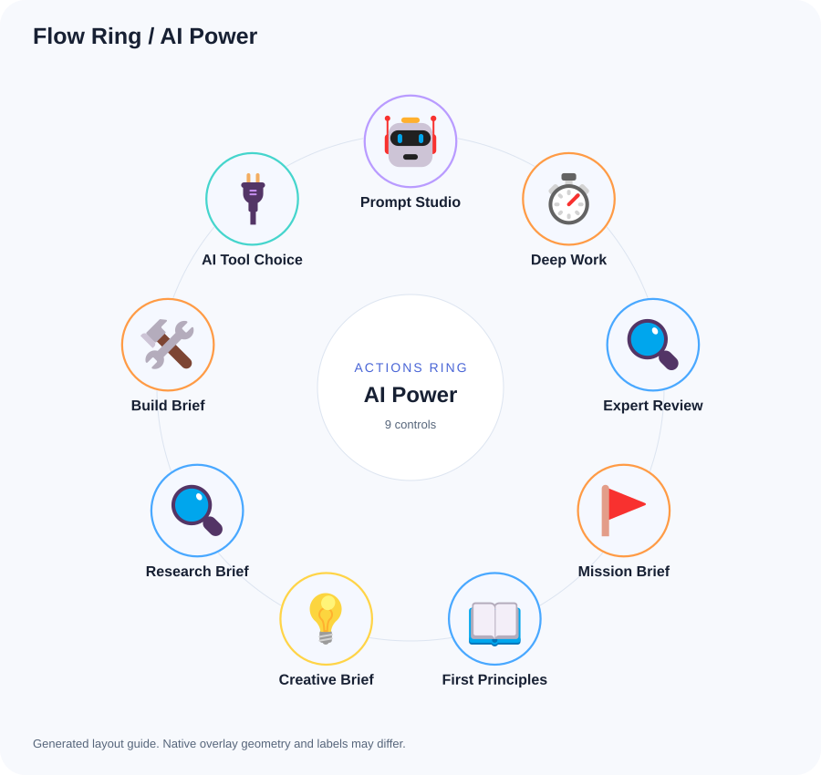
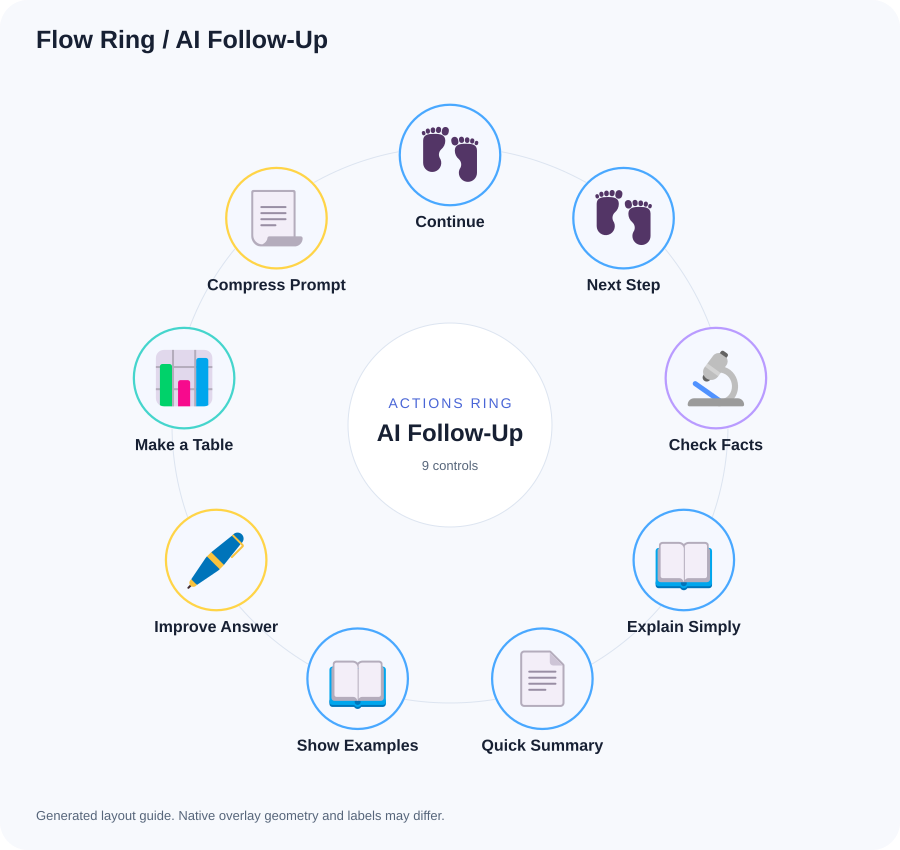
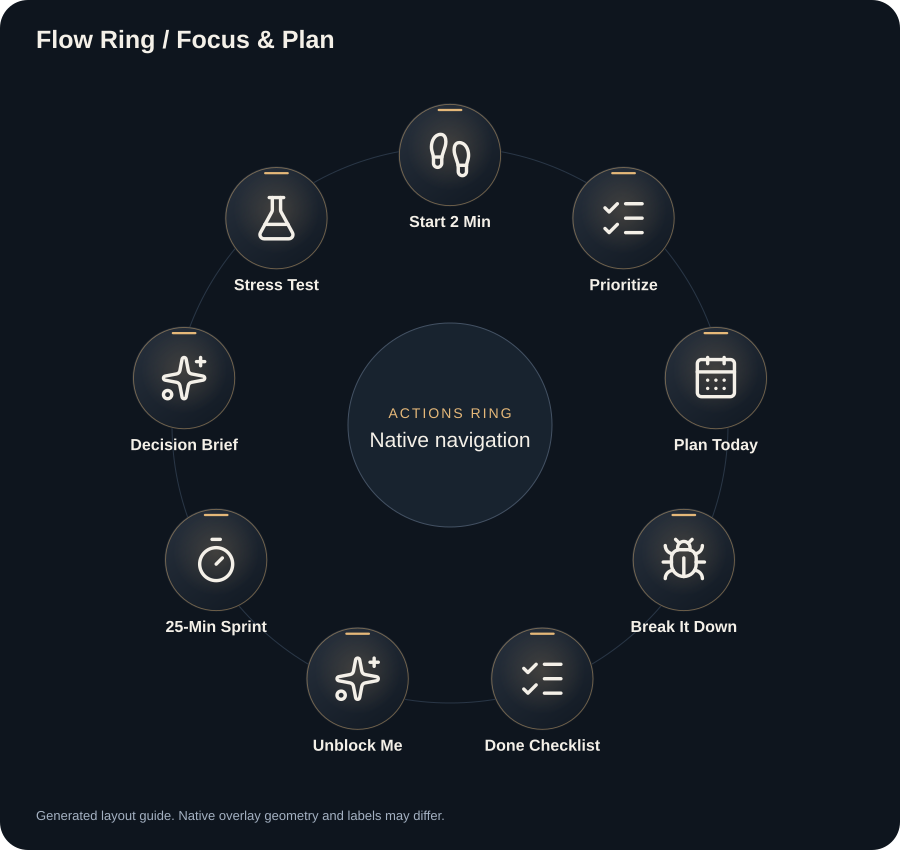
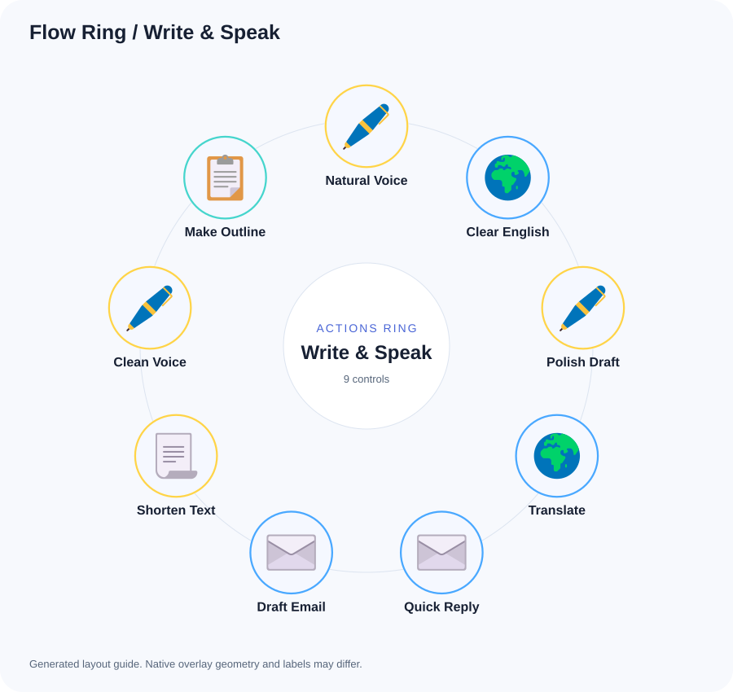
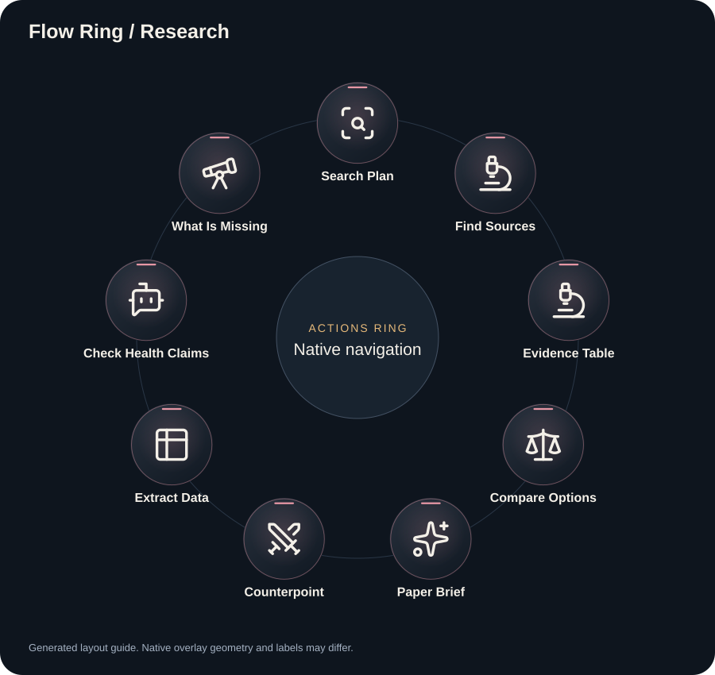
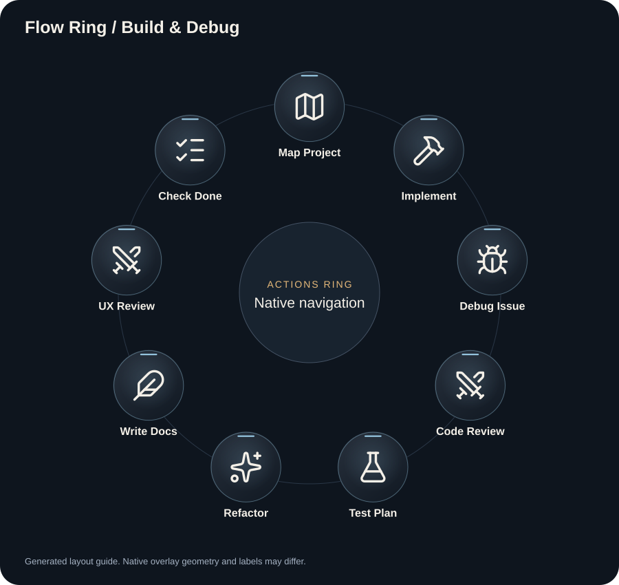
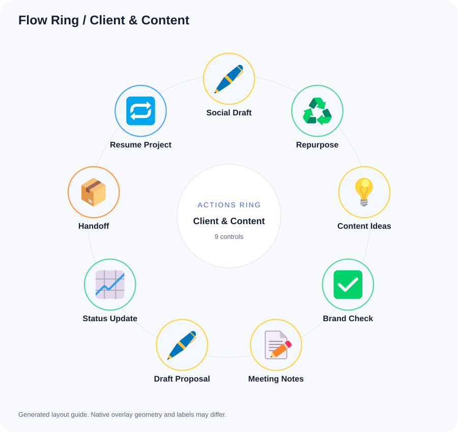
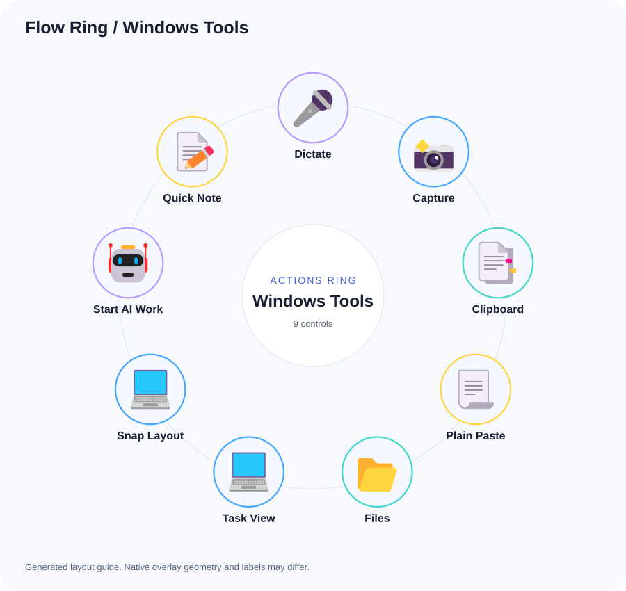

# Flow Ring: action guide

Everyday AI workflows and standard Windows controls in eight folders.

8 source categories across 9 navigation pages including Home. Home has at most 8 controls; action folders have at most 9. When needed, More workflows opens the remaining categories without removing any action.

Text actions wait one second, then paste a prompt without pressing Enter. Windows shortcuts act immediately. Folder navigation is supplied by Logi Options+.

## Home

### 1. AI Power

Open [AI Power](previews/flow-ring-ai-power.svg).

### 2. AI Follow-Up

Open [AI Follow-Up](previews/flow-ring-ai-follow-up.svg).

### 3. Focus & Plan

Open [Focus & Plan](previews/flow-ring-focus-plan.svg).

### 4. Write & Speak

Open [Write & Speak](previews/flow-ring-write-speak.svg).

### 5. Research

Open [Research](previews/flow-ring-research.svg).

### 6. Build & Debug

Open [Build & Debug](previews/flow-ring-build-debug.svg).

### 7. Client & Content

Open [Client & Content](previews/flow-ring-client-content.svg).

### 8. Windows Tools

Open [Windows Tools](previews/flow-ring-windows-tools.svg).

## AI Power

### 1. Prompt Studio

Improve my task brief before solving it: clarify the desired result, supplied context, constraints and success criteria. Ask only questions that materially change the work, then return a reusable prompt. Task: [TASK]

### 2. Deep Work

Work through [TASK] carefully: map constraints, compare credible approaches, choose one, and produce a concrete deliverable with evidence and limits. Work only in the scope I authorize.

### 3. Expert Review

Review [TASK] from three relevant professional perspectives. Separate each perspective's concerns, reconcile disagreements, and recommend one evidence-based direction. Do not pretend real people reviewed it.

### 4. Mission Brief

Turn [GOAL] into an execution brief with scope, available tools, permissions, ordered tasks, acceptance checks and a clear stop condition. Draft only; do not launch work yet.

### 5. First Principles

Break [PROBLEM] into known facts, constraints and assumptions. Challenge weak assumptions, compare plausible solutions and recommend the smallest useful experiment.

### 6. Creative Brief

Draft a creative brief for [PROJECT]: audience, message, desired response, format, visual direction, constraints and acceptance criteria. Identify missing brand inputs instead of inventing them.

### 7. Research Brief

Create a research plan for [QUESTION]: scope, primary sources, evidence standards, competing hypotheses and final deliverable. If research tools are unavailable, return the plan and disclose the limit.

### 8. Build Brief

Turn [FEATURE] into a build brief: user problem, behavior, boundaries, data flow, milestones and tests. Identify unresolved decisions and stop before implementation.

### 9. AI Tool Choice

For [TASK], identify the capabilities needed and compare the AI tools I already have available. Recommend one and explain trade-offs. Do not assume access, buy services or enter credentials.

## AI Follow-Up

### 1. Continue

Continue the current task from the last useful point. Keep the agreed objective and constraints. Complete the next meaningful step with the context and tools actually available, then verify the result. Do not repeat finished work. State what changed and the next unresolved item briefly.

### 2. Next Step

Identify the single highest-value next action toward the current goal. Complete it if it is authorized and possible with the available tools. If my involvement is essential, give me one small, specific action. Keep the response short and explain any actual blocker.

### 3. Check Facts

Check the important factual claims in the previous answer. Verify them against accessible primary sources or project evidence when possible. Correct errors, distinguish confirmed facts from assumptions, and link the evidence. If you cannot verify a claim, say so. Prioritize claims that could change the decision.

### 4. Explain Simply

Explain the previous answer in plain English for a busy reader whose second language is English. Lead with the main point, define necessary terms, and use one concrete example. Keep short paragraphs and preserve the important qualifications. End with one practical action.

### 5. Quick Summary

Summarize this conversation for quick orientation. Use at most 6 bullets covering the goal, current result, decisions, constraints, unresolved issues, and next action. Distinguish completed work from plans. Preserve exact names, dates, and paths when they matter.

### 6. Show Examples

Give 3 concrete examples of the idea in the previous answer, tailored to this task. Start with the most useful everyday example. Show the input, the expected output, and when each example is appropriate. Avoid repeating the explanation.

### 7. Improve Answer

Review the previous answer against my actual goal. Find the 3 most consequential weaknesses, such as missing evidence, impractical steps, or unclear assumptions. Then provide the improved answer. Keep what already works and do not invent new requirements.

### 8. Make a Table

Reformat the relevant information above into a compact table that helps me act or compare. Choose columns suited to the task, keep factual values unchanged, mark missing information as unknown, and remove repetition. Put the recommended choice or first action first.

### 9. Compress Prompt

Shorten [PROMPT] without losing its goal, constraints, inputs or output format. Preserve exact technical terms. Return the compressed prompt and flag any ambiguity.

## Focus & Plan

### 1. Start 2 Min

Help me start this task in 2 minutes. Choose one tiny action that creates useful progress and removes the biggest starting obstacle. Do the setup or first draft for me where possible. Give only the first action and a clear stopping point; keep the larger plan out of this response.

### 2. Prioritize

Prioritize the tasks in the available context by urgency, impact, dependencies, and effort. Pick the top 3 in order. Explain the first choice in one sentence, identify what can wait, and give one concrete starting action. Do not invent deadlines or commitments.

### 3. Plan Today

Turn the known tasks and deadlines into a realistic plan for today. Use the available time information; if working hours are unknown, use a relative sequence rather than invented appointments. Choose up to 3 outcomes, allow breaks and buffer, and state the first small action. Mark uncertain deadlines clearly.

### 4. Break It Down

Break the current task into a short sequence of concrete steps. Make the first step take about 5 minutes. For each step, state the output and how I know it is done. Identify dependencies and remove unnecessary steps. Use the task context instead of generic productivity advice.

### 5. Done Checklist

Create a concise definition-of-done checklist for this task. Use observable results rather than vague quality words. Cover the main requirements, necessary checks, and handoff. Separate essential items from optional improvements. Do not claim any item is complete without evidence.

### 6. Unblock Me

Find the current bottleneck from the available context. Distinguish missing information, a decision, a dependency, and an execution problem. Choose the smallest useful way forward and complete what you can within the authorized scope. Ask one focused question only if progress actually depends on the answer.

### 7. 25-Min Sprint

Plan one 25-minute work sprint for the current task. Choose a single useful deliverable, a 2-minute setup, the main work, and a short check at the end. Define the stopping point and park unrelated ideas. This is a work plan; do not claim that a timer has been started.

### 8. Decision Brief

Prepare a decision brief for [DECISION]: options, evidence, trade-offs, reversibility and one recommendation. State uncertainty and the next small validation step.

### 9. Stress Test

Try to disprove [PLAN]. Identify failure modes, hidden assumptions and the cheapest meaningful tests. Rank by impact and likelihood, then suggest targeted revisions.

## Write & Speak

### 1. Natural Voice

Rewrite [TEXT] naturally in [LANGUAGE / DIALECT], preserving my meaning and tone. Avoid stiff phrasing or invented claims. Return only the revised draft.

### 2. Clear English

Rewrite the relevant text in clear, natural English. Lead with the main point, use familiar words and short paragraphs, and preserve all important facts. Keep exact names, links, dates, amounts, and technical syntax unchanged. Avoid corporate filler and output the rewritten text only.

### 3. Polish Draft

Polish the draft for clarity, flow, and correctness while preserving my voice and intent. Remove repetition and unnecessary formality. Keep facts and technical details exact. Do not add promises or claims. Output the finished draft only.

### 4. Translate

Translate [TEXT] into [TARGET LANGUAGE], keeping tone, names, numbers and intent. Flag ambiguous phrases.

### 5. Quick Reply

Draft a short, warm, direct reply to the relevant incoming message using the conversation context and the appropriate language. Answer what matters, keep commitments within what is known, and do not invent details. Provide one ready-to-review draft. Do not send it.

### 6. Draft Email

Draft a concise email from the available context. Include a clear subject, the main point first, only essential supporting details, and one specific request or next step. Preserve known names and dates. Do not invent a recipient, commitment, or attachment. Provide the draft for review without sending it.

### 7. Shorten Text

Shorten the relevant text by roughly half where possible. Preserve the main point, necessary qualifications, facts, and requested action. Remove repetition and filler without making it abrupt. Keep the original language and output only the shorter version.

### 8. Clean Voice

Clean up the rough voice transcript or notes in the context. Fix obvious transcription errors without changing the intended meaning. Organize the result into a short summary, key details, and action items. Keep unknown names or unclear phrases visibly uncertain. Do not invent decisions or task owners.

### 9. Make Outline

Turn the current idea or material into a practical writing outline for its intended audience. State the core message, arrange the points in a logical order, and identify evidence or examples needed. Keep it focused on the stated format and goal. Mark missing facts instead of filling them in.

## Research

### 1. Search Plan

Turn this topic into a focused research question. Define the scope, the evidence needed, and 5 useful search queries. Prioritize primary sources and distinguish current facts from stable background knowledge. State the main uncertainty and a practical stopping rule for the research.

### 2. Find Sources

Find reliable sources for the current question using the browsing or retrieval tools actually available. Prefer original research, official documentation, and first-party data. Provide direct links, publication dates when known, and one sentence on what each source supports. Do not fabricate citations. If browsing is unavailable, say so and give a focused search plan.

### 3. Evidence Table

Build a compact evidence table for the material in this conversation. Use columns for claim, supporting source, evidence type, limitations, and confidence. Separate direct evidence from inference and identify unsupported claims. Preserve citations and do not invent missing data.

### 4. Compare Options

Compare the relevant options against the criteria that matter for my stated goal. Use a compact table with benefits, drawbacks, dependencies, and known costs or effort. Mark unknowns clearly. Recommend one option and explain the main tradeoff. Verify changing facts with sources when tools are available.

### 5. Paper Brief

Summarize the supplied research paper or study using the material actually available. Cover its question, design, population or data, main results with units and sample size when reported, limitations, and practical relevance. Distinguish association from causation. If only an abstract is available, state that and do not imply full-text review.

### 6. Counterpoint

Find the strongest reasonable counterargument to the current conclusion. Use evidence where available, not a token opposing view. Explain which assumptions it challenges, what evidence would change the conclusion, and whether the recommendation should change. Distinguish uncertainty from disagreement.

### 7. Extract Data

Extract the data relevant to the current task from the supplied material into a clean table. Preserve exact values, units, dates, labels, and source locations. Mark missing values as not reported. Keep measured data separate from your calculations and show any calculation used.

### 8. Check Health Claims

Assess the supplied health claims against current authoritative sources if browsing is available. Distinguish evidence strength, uncertainty and marketing language. Do not diagnose or recommend treatment. Cite sources; otherwise state that verification is incomplete.

### 9. What Is Missing

Audit the current analysis for missing information, weak evidence, assumptions, and outdated facts. Rank the gaps by whether they could change the answer. State the conclusion we can support now and the smallest next check that would reduce uncertainty. Avoid a generic list of caveats.

## Build & Debug

### 1. Map Project

Inspect the project available in this task and map the files and data flow relevant to the requested change. Read applicable project instructions. Identify entry points, dependencies, and the best starting file. Do not guess about files you cannot access. Keep the map concise and tied to the current goal.

### 2. Implement

Implement the agreed change in the available project. Follow its instructions and conventions, preserve unrelated user work, and keep the scope tied to the stated acceptance criteria. Run the checks appropriate to the change. Report the resulting behavior, evidence, and unresolved limitations. Do not deploy or publish unless already explicitly authorized.

### 3. Debug Issue

Investigate the reported issue in the available project. Reproduce it or gather concrete evidence, trace the likely cause, and make the smallest sound fix within the authorized scope. Validate the original failure case and relevant nearby behavior. Distinguish a confirmed cause from a hypothesis and report any remaining blocker.

### 4. Code Review

Review the relevant code changes for correctness, regressions, security issues, and missing handling of realistic edge cases. Prioritize actionable findings and cite exact files and lines when available. Explain the failure condition and impact. Do not invent findings or turn this into a style checklist. State if no material issues are found.

### 5. Test Plan

Create a focused validation plan for the current change. Cover the user-visible success case, likely failure cases, relevant edge conditions, and integration boundaries. Prefer checks that could catch real defects. Run suitable checks if the tools and scope allow, and clearly separate planned checks from executed results.

### 6. Refactor

Refactor the relevant code to reduce complexity while preserving its observable behavior. Focus on a concrete readability or maintenance problem, follow existing conventions, and avoid unrelated cleanup. Make the change if the project is available and it is within scope, then validate the affected behavior. Explain the practical improvement briefly.

### 7. Write Docs

Document the relevant implemented behavior from the code and evidence available. Explain its purpose, setup, normal usage, and meaningful limitations with exact examples. Keep commands and paths correct. Distinguish implemented features from plans. Update the appropriate local documentation if that is within the current task scope.

### 8. UX Review

Review the interface shown or available in this task against the intended user journey. Identify the most consequential friction in hierarchy, wording, navigation, accessibility, and feedback. Tie each finding to visible evidence and suggest a concrete improvement. Distinguish inspected behavior from assumptions. Prioritize a small set of useful changes.

### 9. Check Done

Check the current result against the agreed requirements and acceptance criteria. Make a compact pass, fail, or unverified table with supporting evidence. Separate local validation from live behavior. Resolve remaining in-scope issues when possible and give an honest completion status without expanding the task.

## Client & Content

### 1. Social Draft

Draft one focused social post from the available material for the intended audience and platform. Lead with a useful point, use natural concise language, and preserve supported facts. Use the language, dialect and brand voice I specify. Avoid hype, invented statistics, and forced hooks. Provide a draft for review without publishing it.

### 2. Repurpose

Repurpose the supplied material into 3 useful formats: a short social post, a concise email or message, and a short outline for a visual or video. Adapt the wording to each format while preserving facts and voice. Mark source gaps and provide drafts only.

### 3. Content Ideas

Generate 5 specific content ideas for the audience and goal in this conversation. For each, give the angle, why the audience would care, a suitable format, and the evidence or asset needed. Avoid generic topic lists. Rank the strongest idea first and briefly explain why.

### 4. Brand Check

Review the draft against the brand, audience, and voice requirements actually provided. Flag mismatched tone, unclear claims, inconsistent terminology, and unnecessary formality. Preserve exact approved names and wording. Provide an improved draft, and identify any requirement that cannot be checked from the available context.

### 5. Meeting Notes

Turn the supplied meeting notes or transcript into a concise record: purpose, key decisions, action items, and open questions. For each action include its owner and due date only if stated. Distinguish proposals from confirmed decisions. Preserve important wording and flag unclear details instead of guessing.

### 6. Draft Proposal

Draft a practical proposal from the known client need and project context. Include the problem, intended outcome, scope, deliverables, assumptions, exclusions, and next step. Use only provided prices and dates; mark missing commercial terms as to be agreed. Keep it clear and ready for review without sending it.

### 7. Status Update

Draft a short project status update for the relevant audience. State what was completed with evidence, what is in progress, any actual blocker, and the next step. Distinguish drafted, locally checked, and live work. Use known dates only and do not invent progress or commitments. Do not send the update.

### 8. Handoff

Create a handoff that lets the next session continue this task without repeating work. Include the goal, constraints, decisions, completed work and evidence, exact relevant files or links, unresolved issues, and the next action. Exclude secrets and unnecessary private material. Distinguish current state from planned work.

### 9. Resume Project

Use the available handoff and conversation context to resume this project. Identify the current state, the last completed step, and the next unresolved requirement. Verify changeable assumptions where possible. Continue with one useful authorized step and report its result without repeating completed work.

## Windows Tools

### 1. Dictate

Shortcut: Windows+KeyH___67699721___Win+H___

### 2. Capture

Shortcut: Windows+Shift+KeyS___67699721___Win+Shift+S___

### 3. Clipboard

Shortcut: Windows+KeyV___67699721___Win+V___

### 4. Plain Paste

Shortcut: ControlOrCommand+Shift+KeyV___67699721___Ctrl+Shift+V___

### 5. Files

Shortcut: Windows+KeyE___67699721___Win+E___

### 6. Task View

Shortcut: Windows+Tab___67699721___Win+Tab___

### 7. Snap Layout

Shortcut: Windows+KeyZ___67699721___Win+Z___

### 8. Start AI Work

Help me begin [TASK] in this AI app. Confirm the objective, the context I supplied, available tools and one concrete first step. Do not assume any connected account or hidden memory.

### 9. Quick Note

Turn these notes into a concise scratch note: key facts, decisions, questions and next action. Keep it in this chat unless I authorize a destination. Notes: [TEXT]
