# Work Ring: action guide

81 prompts for clients, team, focus, writing and operations.

9 source categories across 11 navigation pages including Home. Home has at most 8 controls; action folders have at most 9. When needed, More workflows opens the remaining categories without removing any action.

Text actions wait one second, then paste a prompt without pressing Enter. Windows shortcuts act immediately. Folder navigation is supplied by Logi Options+.

## Home

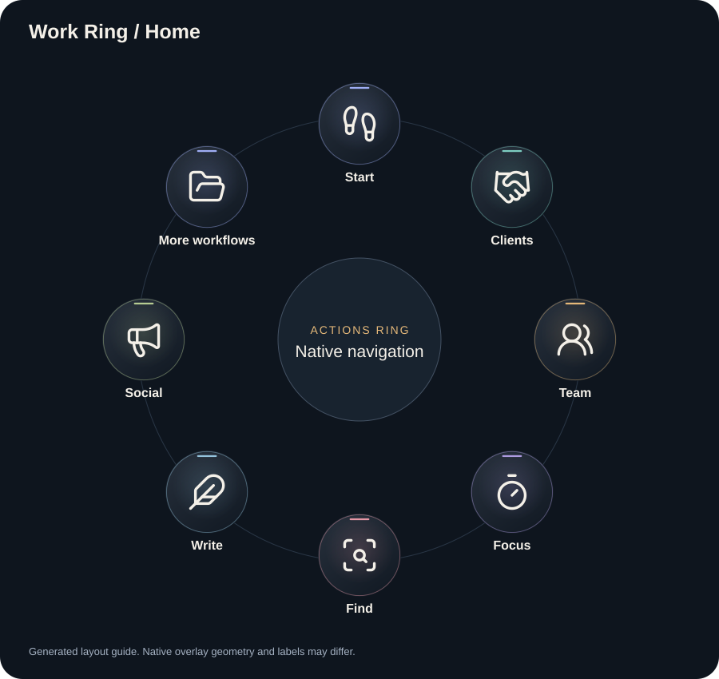

### 1. Start

Open [Start](previews/work-ring-start.svg).

### 2. Clients

Open [Clients](previews/work-ring-clients.svg).

### 3. Team

Open [Team](previews/work-ring-team.svg).

### 4. Focus

Open [Focus](previews/work-ring-focus.svg).

### 5. Find

Open [Find](previews/work-ring-find.svg).

### 6. Write

Open [Write](previews/work-ring-write.svg).

### 7. Social

Open [Social](previews/work-ring-social.svg).

### 8. More workflows

Open [More workflows](previews/work-ring-home-more.svg).

## Start

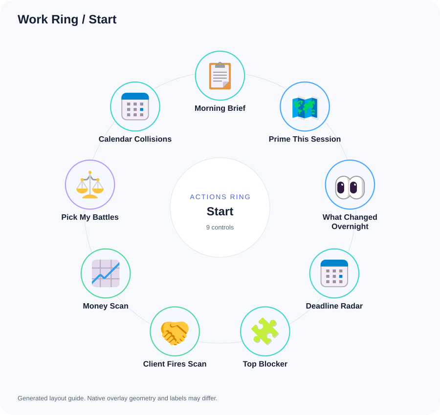

### 1. Morning Brief

Using only the work, calendar and messages I supply or explicitly authorize, prepare a short morning brief: today's commitments, urgent replies, deadlines, top blocker and three priorities. Identify missing sources. Draft only; do not change tasks or send messages.

### 2. Prime This Session

Prime this session cold: check what you remember about my open work, then report what you believe my top 3 priorities are today and why, because I would rather correct your understanding than discover the gap at noon. Send nothing, change nothing, and stop for my correction.

### 3. What Changed Overnight

Check my authorized inbox, messages and task manager for anything new since yesterday evening, and report only the items that need an action from me, one line each, because a digest of everything is a digest of nothing. Send nothing and stop.

### 4. Deadline Radar

List everything due in the next 72 hours across the authorized task manager and what you know of my commitments, one line each, ranked by damage if missed. Flag anything that is impossible to hit so I renegotiate it today instead of apologizing later. Stop there.

### 5. Top Blocker

Across everything you know is open, name the single blocker costing me the most right now and give me the first move against it, startable in 10 minutes, because attacking the wrong bottleneck feels like progress and is not. One blocker only, then stop.

### 6. Client Fires Scan

Scan the client threads and email you can reach for anyone waiting on me, unhappy, or about to escalate, ranked by heat, because a client fire found in the morning costs one message and found at night costs a discount. Report only what needs action, then stop.

### 7. Money Scan

Check for failed payments, unpaid invoices, expiring cards and renewals across what you can reach, because money leaks are silent until they are expensive. Report only actionable items with the fix for each, and stop.

### 8. Pick My Battles

I will tell you my energy level in one word. Based on it, propose the 3 tasks for today, exactly one of them startable in 10 minutes, and name what we are explicitly not doing today, because an unbounded list is how nothing ships. Then stop.

### 9. Calendar Collisions

Check the calendar I authorize against my deadlines and commitments and flag every collision or too-tight gap today and tomorrow, with the resolution for each, because a conflict found now is a reschedule and found live is a no-show. Then stop.

## Clients

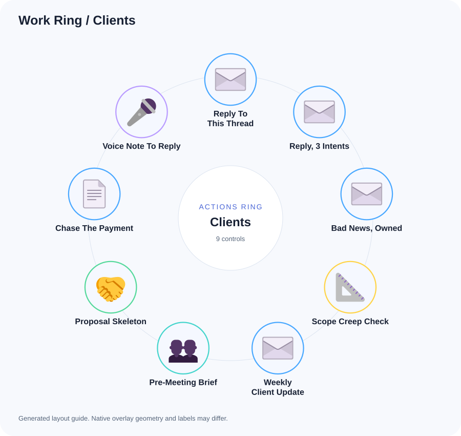

### 1. Reply To This Thread

Draft a reply to the thread I am pasting. Short, warm, plain, lead with the answer, no emojis, no dashes. Give me the message only, nothing around it. Thread:

### 2. Reply, 3 Intents

For the message I am pasting, draft three replies with different intents: agree and commit, push back with a reason, and buy time honestly. Show the one you would send first and say why in one line, because my 20 minutes of staring is usually just an unpicked intent. Message:

### 3. Bad News, Owned

Draft the bad news message for what I am about to describe: own it plainly, give the new date, one line of reason, no groveling and no over-apologizing, because a clean owned delay keeps more trust than a decorated excuse. Message only.

### 4. Scope Creep Check

Here is a client request. Check it against what you know we agreed with this client and tell me if it is in scope. If it is not, draft the kind reply that says this is a paid addition, with a placeholder price, because free scope is a discount nobody thanked me for. Request:

### 5. Weekly Client Update

Draft this week's status update for the client I name, from what you know of their project: what moved, what is next, what I need from them. Six lines maximum, warm and plain, because a long update is an unread update. Message only.

### 6. Pre-Meeting Brief

Give me everything relevant about the client I am about to meet, in 10 lines: state of work, open items, last decisions, money status, and the one thing to raise, because walking in primed is the whole difference. Then stop.

### 7. Proposal Skeleton

Turn the request I am pasting into a proposal outline: understanding of the need, approach, deliverables, timeline, price placeholders, and next step, because a proposal started from blank is a proposal delayed a week. Outline only, then stop. Request:

### 8. Chase The Payment

Draft the payment reminder for the invoice I describe: polite, firm, specific amount and date, one clear way to pay, because awkwardness about money is how it stays unpaid. If this is the second reminder, make it firmer without apology. Message only.

### 9. Voice Note To Reply

From the voice note transcript I am pasting, extract what they are actually asking for in one line, then draft my reply, because the ask is usually buried in minute two. Message only. Transcript:

## Team

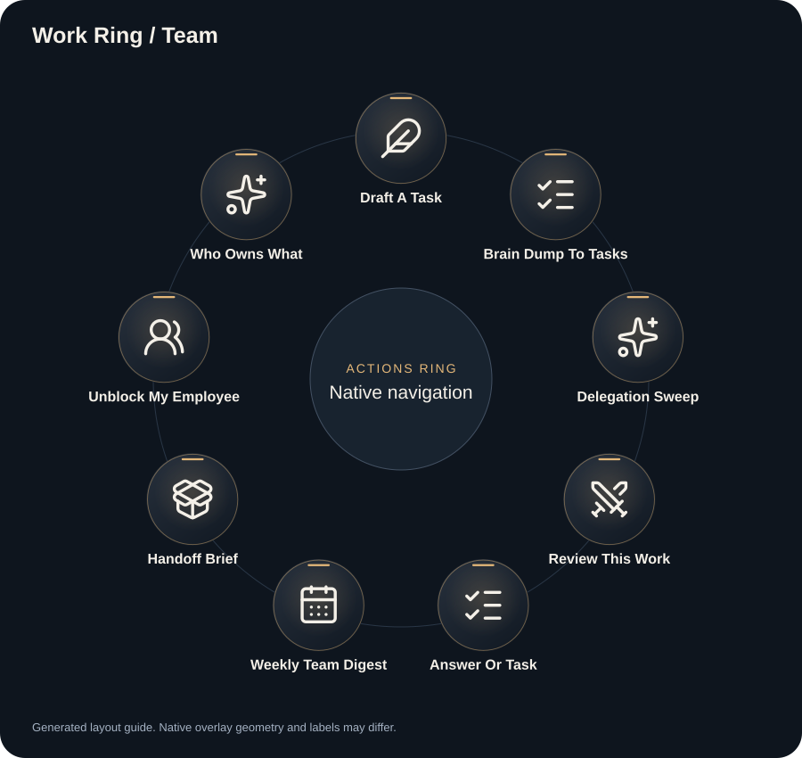

### 1. Draft A Task

Turn the supplied content into a task draft: action title, description, proposed owner, project, due date and acceptance criteria. Use only the team and project details I provide. Mark unknown fields. Do not create or assign a task until I approve the draft.

### 2. Brain Dump To Tasks

Turn my brain dump into tasks grouped by project. Use short action titles and suggest owners and dates only from supplied context. Identify the one task I should start now. Return drafts; do not create tasks or notify anyone.

### 3. Delegation Sweep

Check the authorized task manager for tasks that are overdue or due today per employee, and draft one short reminder draft for each person in their language, specific to the task, because a generic reminder trains people to ignore reminders. Show me the drafts, send nothing, and stop.

### 4. Review This Work

Review the work I am pasting or screenshotting the way I would: specific, kind, and actionable, lead with what is right, then the fixes ranked by importance, because vague feedback produces a second bad version. Draft it as a message to the person. Work:

### 5. Answer Or Task

Decide whether the supplied message needs an answer or a task. Draft a short answer or a task with proposed owner and acceptance criteria. State missing details; do not create, assign or send anything.

### 6. Weekly Team Digest

From the authorized task manager, summarize what each employee completed this week, one line each with the specific thing, so I can thank people for specifics and not for vibes, because specific praise is the cheapest retention tool I have. Then stop.

### 7. Handoff Brief

Turn what I am about to describe into a delegation brief: context in two lines, the exact deliverable, deadline, references or examples, and what done looks like, because a task handed off without a definition of done comes back twice. Format it ready to paste into the authorized task manager.

### 8. Unblock My Employee

Someone on my team is stuck on what I am pasting. Give me the smallest unblocking instruction I can send them right now, not a lecture, because their blocked hour costs more than my perfect answer. Message only. Their problem:

### 9. Who Owns What

From the authorized task manager, show me the current load per person: how many open tasks, what is heavy, who is overloaded and who has slack, because I delegate by memory and memory lies. Flag any task with no owner. Then stop.

## Focus

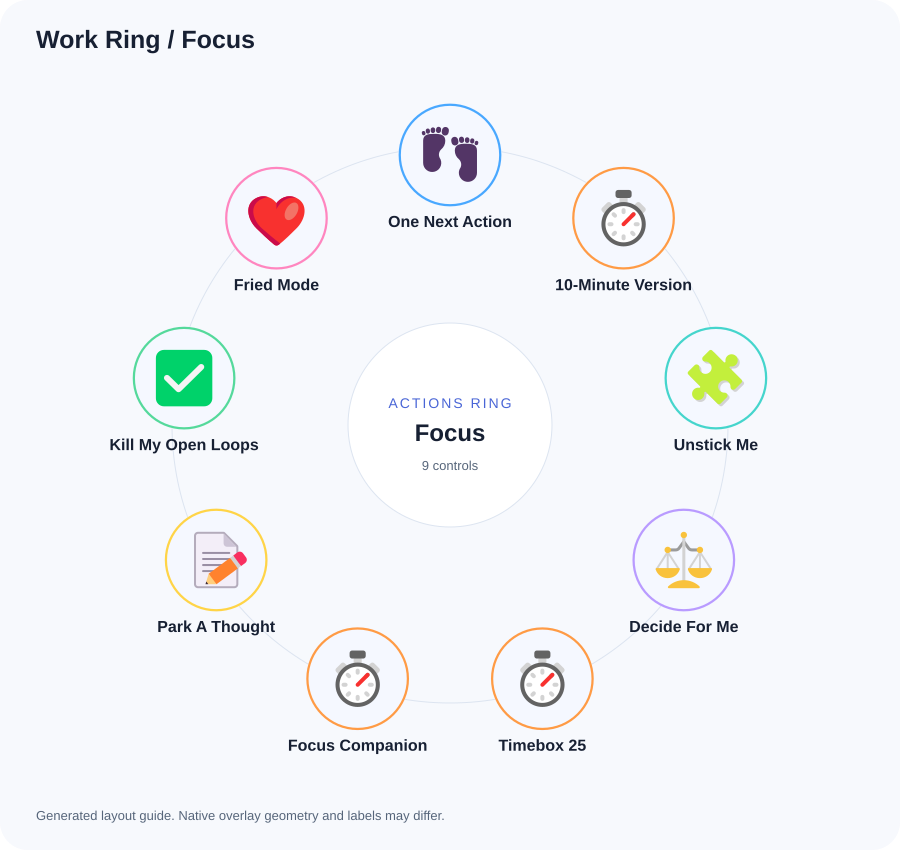

### 1. One Next Action

Ask me nothing. Based on what you know about my open work, give me exactly ONE next action I can start in the next 10 minutes. One line. No options.

### 2. 10-Minute Version

Take the task I am about to describe, the one I keep avoiding, and shrink it to a 10 minute version that still moves it forward, because starting is the entire battle and the size of the task is the enemy. One version only, then stop.

### 3. Unstick Me

I am stuck. Ask me at most 2 questions, then give me the smallest possible first step. Do not give me a plan, give me a first move.

### 4. Decide For Me

I keep circling a decision. I will describe it. Pick one option for me, state it in one line, give 2 reasons, and the first step, because a reversible decision does not deserve a third day of my loops. No pros and cons table.

### 5. Timebox 25

I am starting a 25 minute block. Ask me what I am working on in one line, then give me a 3 step plan sized to exactly fit 25 minutes, because a plan bigger than the box guarantees the box fails. Nothing else.

### 6. Focus Companion

Help me work on [TASK] for a 25-minute block. Define one finish line and ask me to return at a checkpoint. Check in when I message you; do not promise background monitoring or timed notifications unless supported and authorized.

### 7. Park A Thought

Capture [THOUGHT] in a short note in this chat so I can return to [CURRENT TASK]. Do not promise a future reminder unless a reminder tool is available and I explicitly authorize one.

### 8. Kill My Open Loops

I will list the loops open in my head. For each one tell me: close it now in 2 minutes, delegate it, schedule it, or drop it, and be willing to say drop, because carrying them all is the actual exhaustion. Then give me the single loop to close first.

### 9. Fried Mode

I am fried. Give me one genuinely useful task that needs zero thinking and zero decisions, from my real open work, because a tired hour can still ship something mechanical. One task, then stop.

## Find

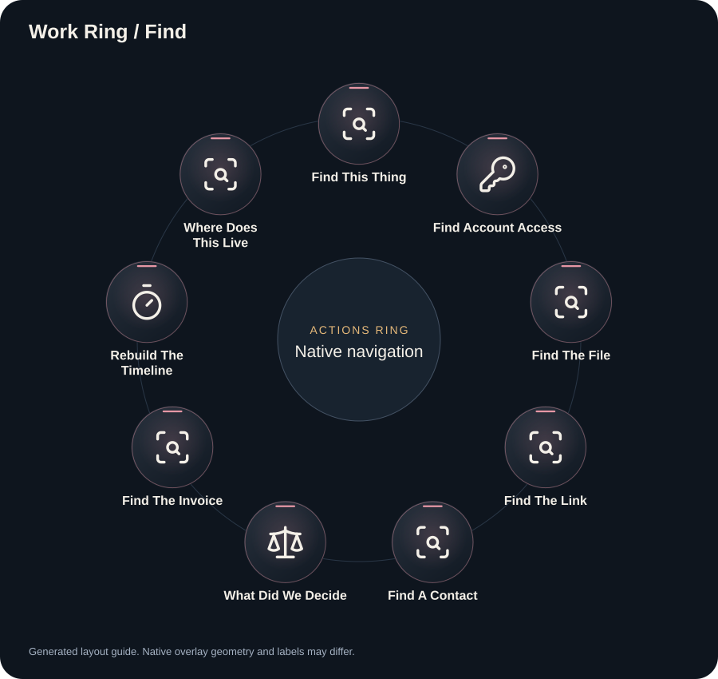

### 1. Find This Thing

Find [ITEM] in the sources I name and authorize. Try relevant spelling variants. Report the source, date and matching evidence. If it is inside an attachment, identify the file without guessing its contents. Do not search unapproved accounts.

### 2. Find Account Access

For [SERVICE], identify the official sign-in or account recovery route and the name of the approved password-manager entry, if available. Never retrieve, print or paste passwords, tokens, recovery codes or secret values. Let me complete authentication in the service or vault.

### 3. Find The File

Find [FILE DESCRIPTION] in the folders or connected sources I explicitly authorize. Return the exact matching path or link with date and source. Identify uncertain matches and inaccessible sources. Do not search other accounts or private directories.

### 4. Find The Link

Find the last URL shared about the topic I name, across the messaging and email sources I authorize: the link itself, who sent it, and when, because I remember the link exists and nothing else. Topic:

### 5. Find A Contact

Find [CONTACT] in the address book or business records I explicitly provide or authorize. Resolve ambiguous names before returning the relevant business contact entry. Do not infer identities or search unrelated personal records.

### 6. What Did We Decide

Search our past chats for what we decided about the topic I name. Quote the decision with its date and which chat it came from, and separate what I decided from what you merely suggested, because your suggestions are not my commitments. Topic:

### 7. Find The Invoice

Find the transaction I describe in the email sources I authorize: amount, date, sender, and the attachment if there is one, because tax season does not accept I think I paid it. Transaction:

### 8. Rebuild The Timeline

Rebuild the timeline of the topic I name: every relevant message, file and decision in order, each with its source and date, because the story assembled beats my memory arguing with itself. Then give me the current state in 2 lines. Topic:

### 9. Where Does This Live

Tell me which account, email or platform the subscription or asset I name is registered under: search email for signups, billing and receipts, because I have too many accounts and each service picked its own. Report the owner account and its payment state. Asset:

## Write

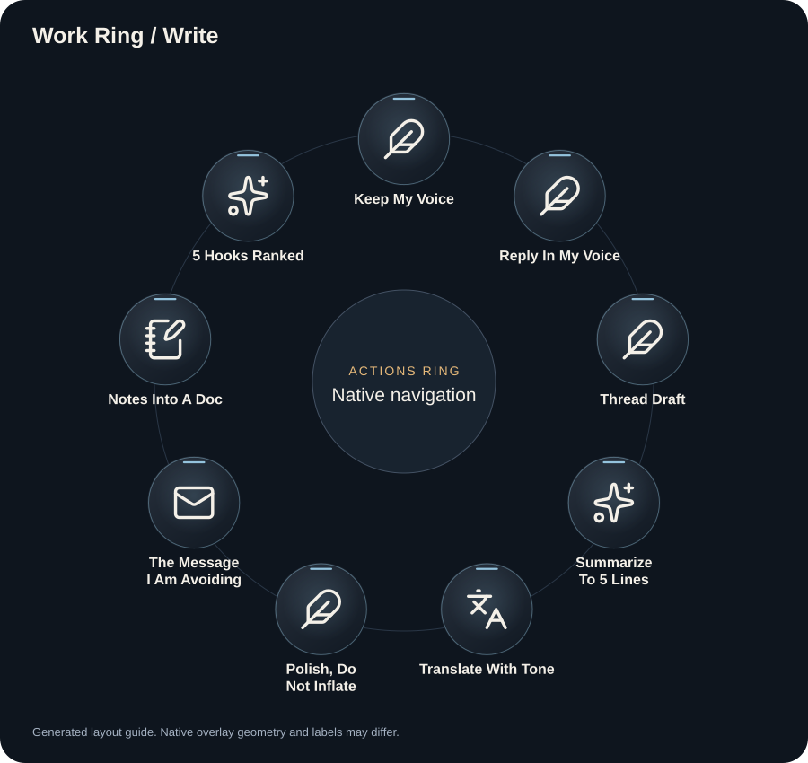

### 1. Keep My Voice

Edit my supplied draft in [LANGUAGE / DIALECT]. Preserve my wording, rhythm and tone. Fix only errors or unclear passages. Return the minimally edited draft and list any uncertainty separately. Draft: [TEXT]

### 2. Reply In My Voice

Write my reply to the email I am pasting. Direct, no fluff, lead with the decision, 5 lines maximum. Output only the email body, because I will paste it as-is. Email:

### 3. Thread Draft

Turn [CONTENT] into a thread of up to six posts for [PLATFORM] in [LANGUAGE / TONE]. Lead with a useful hook, keep claims grounded in the supplied content and respect the platform limits. Draft only.

### 4. Summarize To 5 Lines

Compress what I am pasting into 5 lines I can actually scan. Keep numbers, names and dates exact, because a summary that rounds the numbers is a new document. Content:

### 5. Translate With Tone

Translate [TEXT] from [SOURCE LANGUAGE] into [TARGET LANGUAGE], preserving tone, meaning, names and numbers. Flag ambiguity instead of inventing context. Return the translation.

### 6. Polish, Do Not Inflate

Fix only what is broken in the text I am pasting: grammar, clarity, one dragging line. Keep my length, my voice, and my structure, because polishing is not rewriting and inflation is not improvement. Return it with minimal edits. Text:

### 7. The Message I Am Avoiding

I have been avoiding writing something. I will describe it. Draft it direct and kind, say the hard part in the first two lines, because the version I keep postponing gets worse every day it waits. Message only.

### 8. Notes Into A Doc

Structure the mess I am pasting into a clean document: a title, sections that follow the actual logic, and the loose ends listed at the bottom as open questions, because unstructured notes are write-only memory. Notes:

### 9. 5 Hooks Ranked

Give me 5 opening hooks for the content I am pasting, ranked, with one line on why the top one wins, because the first line decides whether the rest exists. No hashtags, no emojis. Content:

## Social

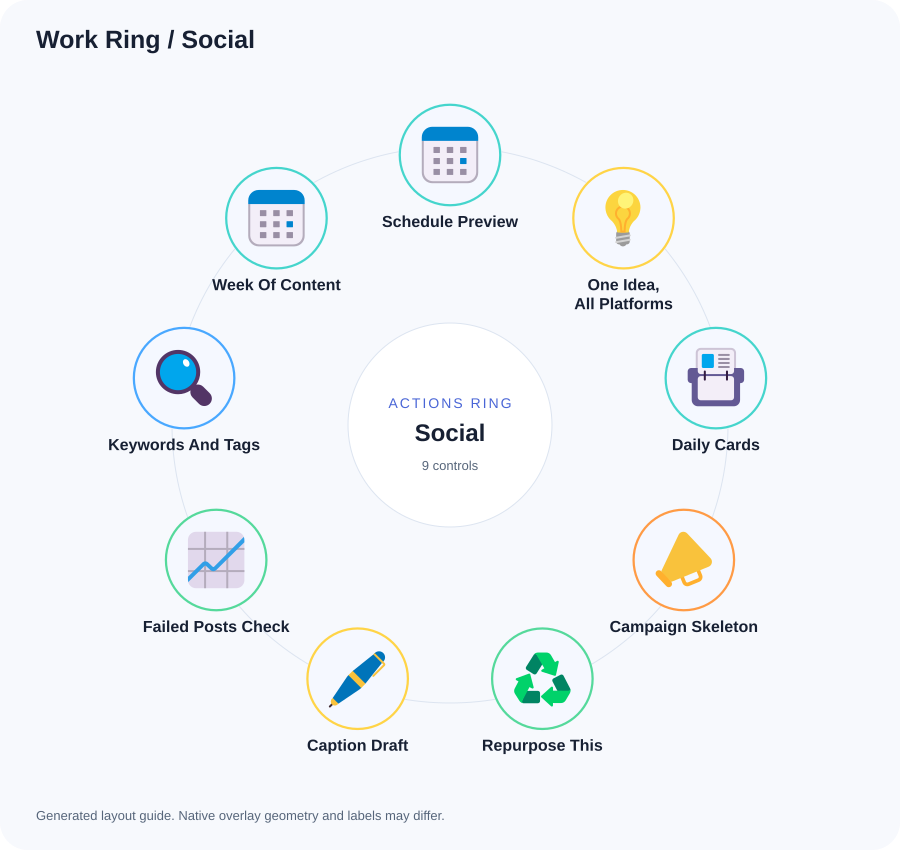

### 1. Schedule Preview

Prepare a scheduling preview for [CONTENT]: exact account, channel, date, time zone, media and final text. Ask for missing details together. Show exactly what would publish and stop for approval before scheduling or posting.

### 2. One Idea, All Platforms

Take the idea I am pasting and draft platform variants for the brand I name: IG caption, X post, LinkedIn post, each in that platform's rhythm and the brand's voice, because one text pasted everywhere reads pasted everywhere. Idea:

### 3. Daily Cards

Use the supplied daily stories and brand guide to prepare distinct social cards for [FORMAT / SIZE]. Keep sources, dates and claims accurate. If image tools are available and authorized, create draft visuals; otherwise provide final copy and a layout brief. Do not publish.

### 4. Campaign Skeleton

Build the campaign skeleton for the promo I describe: audience, the one angle, 3 posts with timing, and the CTA, because a campaign without one angle is three unrelated posts. Skeleton only, then stop.

### 5. Repurpose This

Turn the long content I am pasting into a carousel outline with a caption: slide-by-slide text, 8 slides maximum, hook on slide one, because long content unrepurposed is reach left on the table. Content:

### 6. Caption Draft

Write a two-line caption for [PRODUCT / IMAGE] in [LANGUAGE / TONE]. Match the supplied brand voice, avoid unsupported claims, and include a clear next step when appropriate. Return a draft only.

### 7. Failed Posts Check

Check the authorized publishing service for failed posts today: group the failures by channel, name the likely cause for each group, and give me the reconnect order that fixes the most with the fewest logins, because token rot eats mornings silently. Then stop.

### 8. Keywords And Tags

Give me the keywords and tags for the post I am pasting, per platform, only ones that fit the actual content, because tag spam reads desperate and ranks worse. Post:

### 9. Week Of Content

Draft a 7 day content plan for the brand I name from what you know of it: one line per day with format and topic, one day deliberately light, because a plan I cannot sustain is a plan I abandon by Wednesday. Plan only, then stop.

## Operations

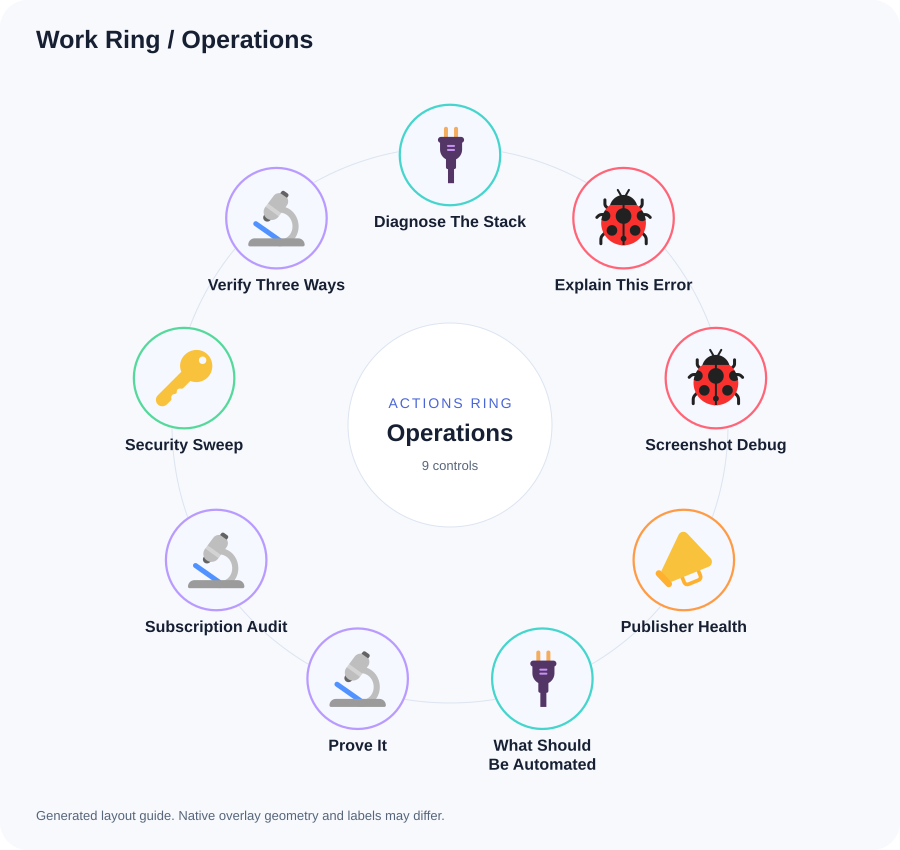

### 1. Diagnose The Stack

Diagnose the failing system from the supplied logs and configuration. Identify the failing layer, evidence, likely cause and one targeted next diagnostic. Do not restart services, change configuration or expose secret values. State what has not been verified.

### 2. Explain This Error

Explain [ERROR] in two plain sentences. Identify the affected component and show one evidence-based fix or diagnostic command. Mark commands that would change state and wait for approval before running them.

### 3. Screenshot Debug

Look at the screenshot I am pasting and tell me what is broken, one fix only, because a list of five maybes is a fix for nothing. If you need one more screenshot to be sure, name exactly which screen.

### 4. Publisher Health

Inspect the explicitly authorized publishing service for failed jobs, disabled channels and authentication status. Return a prioritized repair plan without exposing tokens or changing connections. A connected badge is not proof that posts were delivered.

### 5. What Should Be Automated

Look at what we just did or what I describe, and tell me if this is the third time or more. If yes, spec the automation: trigger, steps, where it runs on my machines, and the first 15 minute step to build it, because a loop survived three times will survive thirty. Then stop.

### 6. Prove It

Paste the proof of what you just claimed: the actual output, the file diff, or the screenshot, because I do not accept a summary as evidence. If you did not actually run or check it, say so plainly before we continue.

### 7. Subscription Audit

Audit my subscriptions from what you can reach in email: what I pay for, what overlaps, what looks idle, and what is on the wrong account, because tools multiply and cancellations do not. Rank the cuts by monthly savings, then stop.

### 8. Security Sweep

Look at what we just handled and flag every security smell: plaintext credentials, shared logins, weak passwords, things that should move to the vault, because convenience debt compounds into an incident. Rank by risk with the 5 minute fix for each, then stop.

### 9. Verify Three Ways

Take the conclusion we just reached and try to disprove it three separate ways before I act on it, because a claim I cannot falsify is not worth acting on. Report which attempts failed to break it and which succeeded, then stop.

## Recover

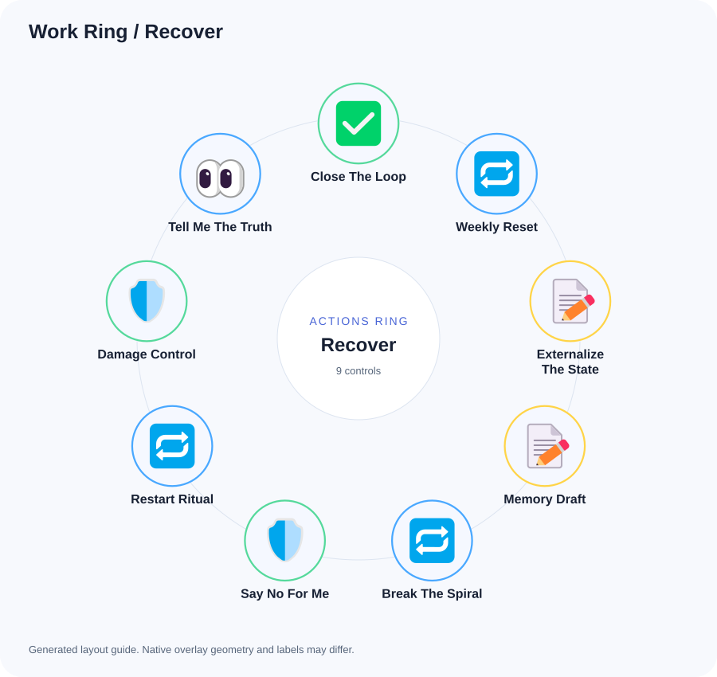

### 1. Close The Loop

End of day check. What did I ship today, what is still open, and what is the first thing I touch tomorrow morning. Keep it under 12 lines, because tomorrow-me should start with zero decisions.

### 2. Weekly Reset

Review the projects I list: one line of current state for each, with evidence or an unknown marker. Choose the three priorities for the coming week, explain what can wait and name the first small action. Do not invent projects or change their status.

### 3. Externalize The State

Write the current state of what we are working on so a fresh chat can continue cold: done, in progress, decisions with reasons, open questions, and the exact next step, because this window will not survive and the summary is what does. Then stop.

### 4. Memory Draft

Draft a concise memory update from today's confirmed facts, decisions, corrections and completed work. Exclude sensitive information. Show the exact text and destination, if known. Do not persist anything until I approve it.

### 5. Break The Spiral

I am overwhelmed. Cut my list to 3 things and explicitly name what we are dropping or deferring, because the full list is the weight. No motivation speech, just the 3 and the first move on the first one.

### 6. Say No For Me

Draft the decline for the ask I am about to describe: kind, short, final, no fake maybe-later unless I say so, because a soft no becomes a second ask next week. Message only.

### 7. Restart Ritual

I lost the thread of the project I name. Rebuild where we were: last state, last decisions, what stalled it, and the smallest step that restarts momentum, because re-entry cost is why paused projects die. Then stop.

### 8. Damage Control

Something went wrong with a client or publicly. I will describe it. Give me the first 3 moves in strict order, the first one doable in 10 minutes, and draft the first message, because speed of the first response sets the whole tone. Then stop.

### 9. Tell Me The Truth

Look at everything you know about my work right now and tell me plainly what I am avoiding and what is not working, with evidence only, no cushioning, because the comfortable version costs me months. Three items maximum, then stop.

## More workflows

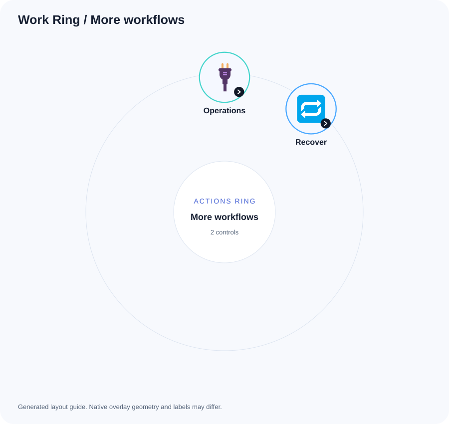

### 1. Operations

Open [Operations](previews/work-ring-ops.svg).

### 2. Recover

Open [Recover](previews/work-ring-rescue.svg).
